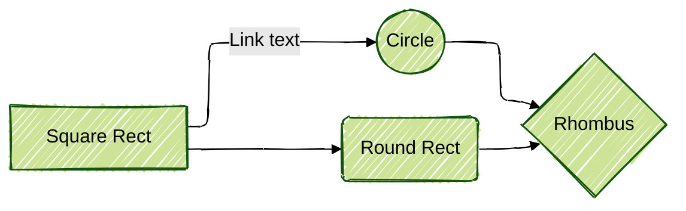
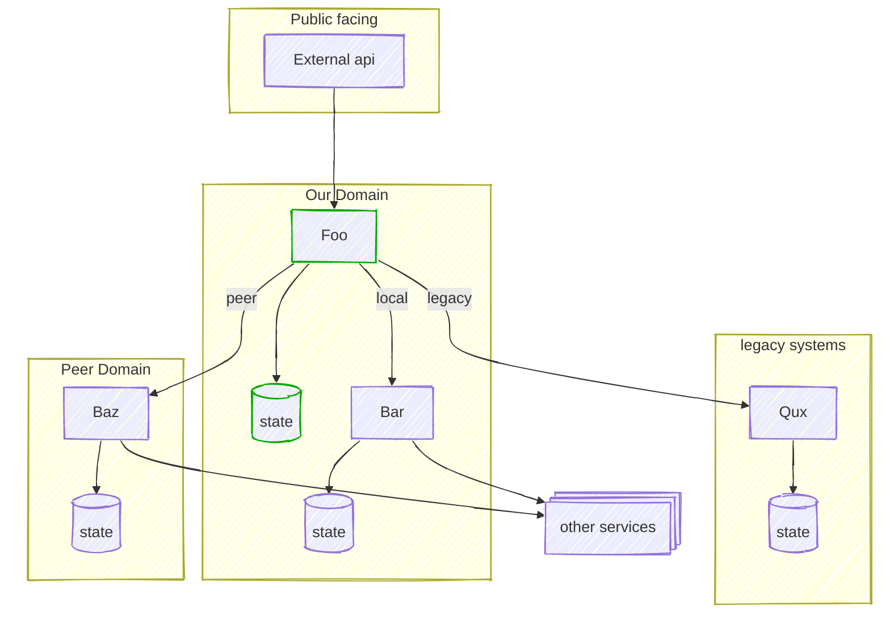

## Why Mermaid?

I've always loved diagrams as code - you can easily express graphical information in a text file, with easy searching, renaming, git tooling, and it encourages you to keep things simple rather than getting caught up in presentation.

I was a long-time user of [PlantUML](https://plantuml.com/) - it has a lot of diagram types and options, a lot of tweakability, and is open and can run anywhere. But - anywhere means "anywhere with a Java VM", and about ten years ago, [Mermaid.js](https://mermaid.js.org/) came along as a javascript-based alternative, where "anywhere" became "anywhere with a DOM and Javascript"

For many years I was skeptical about Mermaid. It was significantly limited compared to PlantUML. It needed a DOM so was a hassle to run offline. And the layout engine kind of sucked. PlantUML still gives you a lot more control - you can say "this line should go right, this line should go down" and there are many ways to tweak it. Mermaid's engine is much more chaotic - [tiny changes can radically change the whole layout](https://github.com/mermaid-js/mermaid/issues/815). Whenever I tried it I found myself playing whack-a-mole trying to get things to look how I liked.

In most of these areas things have improved. Diagram features are much improved. Tool support is drastically better - see the table below. It turns out, being built in Javascript made it much much easier for vendors to support it, and they did. And there's a new layout engine, using [ELK - the Eclipse Layout Kernel](https://eclipse.dev/elk/) which looks like it gives you more control - if your platform supports it:

| Platform      | Mermaid version | Elk? |
| ------------- | --------------- | ---- |
| Obsidian      | 11.4.1          | N    |
| VScode plugin | 11.4.0          | Y    |
| Notion        | 11.3.0          | N    |
| Github docs   | 11.4.1          | N    |
| Jekyll blogs  | roll your own   | Y    |

(Jekyll requires you to install Mermaid yourself - but it was quite easy to install it from a CDN for this blog)

Mermaid still isn't as sophisticated as [the alternatives](#alternative-tools) - but it is now everywhere, and doesn't require any effort to use - so it seems that unless my needs are complex, I should default to Mermaid - so I wanted to see what it offers now.

## New Mermaid features

I'm not going to cover all Mermaid features, but I thought it was worth highlighting a few important bits - especially where they make my life easier!

### A note on syntax changes

Mermaid have had to maintain backward compatibility with all previous versions, which means it is quite tricky sometimes to find the "right" syntax to use. A lot of examples, and some of the official docs, still use older syntax, which appears to have been replaced recently. I'll try to mostly use the newest syntax.

### Configuration in frontmatter

Mermaid configuration seems to have gone through a few iterations. You can configure things globally in various ways I won't cover here, but within a single diagram these days you can add front-matter in YAML:

```text
---
config:
  layout: elk
  look: handDrawn
  theme: forest
---
graph LR
    A[Square Rect] -- Link text --> B((Circle))
    A --> C(Round Rect)
    B --> D{Rhombus}
    C --> D
```



Here I've set the layout to the new Elk engine, set a "hand drawn" style, and chosen a colour theme. This is what it looks like without the frontmatter:


A lot of the docs still refer to the previous style, but it's pretty easy to work out the equivalent yaml:

```text
%%{init: {'theme':'forest'}}%%
```

becomes:

```yaml
config:
  theme: forest
```

### Themes

As shown above you can choose [themes](https://mermaid.js.org/config/theming.html). You can also set properties yourself, though you need to chose the "base" theme first:

```text
---
config:
  theme: base
  themeVariables:
    primaryColor: 'red'
    primaryTextColor: 'white'
    fontSize: 32px
    lineColor: 'green'
---
graph TD
 A --> B
```

gives:


See also [classes and styles](#classes-and-styles) below.

### Configuring elk

If you have Elk layout installed you have some configuration options - [see the docs here](https://mermaid.js.org/intro/syntax-reference.html#customizing-elk-layout).

### Flowchart changes

I tend to use the flowchart for 90% of diagrams - it's actually a general purpose graph, you can even use "graph" as the name, though examples tend to use "flowchart"

#### Node shapes and syntax

You used to only define node shapes using special in-line characters:

```text
s["My service"] --> db[("My database")]
```


Wrapping the label in `[]` gives a standard rounded rectangle, `[()]` gives a database-style shape, and so on. [See the docs for more.](https://mermaid.js.org/syntax/flowchart.html#node-shapes)

But this falls apart when you have a lot of shapes! So there's a new syntax, where you define the shape in a more verbose `@{}` way:

```text
s["my service"] --> N@{ shape: card, label: "My Note" }
```

These days I prefer to define shapes before I use them though, when they get verbose like this, so I'd probably write

```
S["My Service"]
N@{ shape: card, label: "My Note" }
S --> N
```


[There are a _lot_ of new shapes!](https://mermaid.js.org/syntax/flowchart.html#complete-list-of-new-shapes)

### Subgraphs

Subgraphs have been around for a while, but they seem more reliable now I think. And you can give them IDs, and link between subgraphs and nodes. (Note indenting is optional but makes them less confusing)

```text
flowchart TB
c1-->a2
subgraph ide1 [My IDE]
  a1-->a2
  subgraph two [My VM]
    a3
  end
a2-->a3
end
d-->two
```


### Link text

I'm honestly not sure if this is new or not. But you can add text to a link in two ways:

```text
A-- text inside an arrow -->B
A-->|text after an arrow|B
```


I find the second syntax much clearer - espeically if you are using diffent link styles (you can do dotted or thick links, and change the arroes - [check the docs for syntax](https://mermaid.js.org/syntax/flowchart.html#links-between-nodes))

### Classes and styles

You can change the style of nodes and of links. [There are too many ways to do this](https://mermaid.js.org/syntax/flowchart.html#styling-and-classes) - they tend to boil down to changing CSS styles, so you probably need to be familiar with that.

My preferred way is to define a class using `classdef <name> <style>;` and then add the class to a node with `:::`, or assign classes to nodes with `class [list of classes] <className>;`

```text
classDef someclass fill:#f9f,stroke:#333,stroke-width:4px;
A:::someclass --> B
class B someclass;
```


This makes it possible to use classes to organise styling of similar nodes throughout your diagram.

See [the docs](https://mermaid.js.org/syntax/flowchart.html#styling-and-classes) for all the other ways to do styling.

### The power of invisibility

One technique I found from PlantUML which also works well in Mermaid is to use invisible elements to control layout.

Invisible links between elements will encourage them to be closer to each other, but the line will be hidden:

```text
A ~~~ B
```

You can add invisibility to other types using CSS - a very handy technique is to use invisible subgraphs to cluster things (including other subgraphs):

```text
graph LR;
classDef invisible fill:#0000, stroke:#0000;
subgraph friends_of_carlotta[" "]
a["Carlotta"]
b["Cody Jarrett"]
end
subgraph enemies_of_carlotta[" "]
c["Swede Anderson"]
d["Kitty Collins"]
end
d-->a
class friends_of_carlotta,enemies_of_carlotta invisible;
```

Here, even though Kitty and Carlotta are connected, they stay with their friends due to the hidden subgraph


### A bigger example

I thought it might be helpful to have an example of a complete diagram - I've been working on a piece about integration and end-to-end testing approaches; this is what I'm using at the moment for my base diagram (text version is below):



```text
---
config:
  look: handDrawn
  theme: default
  <!-- layout: elk - makes it too narrow! -->
---
graph TD;
classDef sut stroke:#0A0;
subgraph ext["Public facing"]
direction LR
ex_api["External api"]
end
subgraph peers[" "]
direction LR
subgraph Our Domain
direction LR
a["Foo"]:::sut --> db_a[("state")]:::sut
b["Bar"] --> db_b[("state")]
ex_api --> a
a -->|local| b
end 
style peers fill:#0000, stroke:#0000
subgraph Peer Domain
direction LR
peer_a["Baz"] --> peer_a_db[("state")]
a -->|peer| peer_a
end
end
subgraph legacy["legacy systems"]
direction LR
leg_d["Qux"] --> leg_d_db[("state")]
a -->|legacy| leg_d
end
deps@{ shape: st-rect, label: "other services" }
b --> deps
peer_a --> deps
```


## Other diagram styles

It seems most changes happen to flowchart/graph diagrams first, but some of the above is being added to other diagram types.

There are also a _lot_ of new diagram types - I won't cover them all, but they include:

- [An Entity-Relationship diagram](https://mermaid.js.org/syntax/entityRelationshipDiagram.html)
- [a Gantt chart](https://mermaid.js.org/syntax/gantt.html)
- [a Git graph diagram](https://mermaid.js.org/syntax/gitgraph.html)
- [a Mindmap](https://mermaid.js.org/syntax/mindmap.html)
  - which is a nice idea but I don't find the style great - I prefer to hand-draw mind maps.
- [an experimental C4 diagram](https://mermaid.js.org/syntax/c4.html)
- a few kinds of chart like [XY chart](https://mermaid.js.org/syntax/xyChart.html) and [Sankey diagram](https://mermaid.js.org/syntax/sankey.html)
- [a Kanban wall](https://mermaid.js.org/syntax/kanban.html)
- [a Quadrant chart](https://mermaid.js.org/syntax/quadrantChart.html)
- [Block diagrams](https://mermaid.js.org/syntax/block.html), which seem to be a way to build your own layouts in a css-grid style way

All of these may have their uses - I've already used the Quadrant chart a few times - but mostly I use the good old flowchart.

## Alternative tools

There are lots of alternative diagrams-as-text tools out there.

I tend to use mermaid for simple things, or [Excalidraw](#excalidraw), for anything more complex or where I want to control the layout, but there are a few intriguing alternatives:

### D2

[D2](https://d2lang.com/) is quite new, written in Go so a lot newer codebase than some. They [have written their own comparison site](https://text-to-diagram.com/) so you can compare their tool to others - they claim it is unbiased! (though I note it's a bit behind the current Mermaid features).

It has a lot of neat features:

- supports multiple layout engines (including a commercial one - not sure if that's good or bad, people need income)
- you have a lot more control over shapes and sizes
- it uses markdown for text formatting (Mermaid has some markdown but it's quite limited)
- it supports source code blocks
- it allows for reuse - you can define variables, you can include diagram snippets

That last one alone intrigues me - if I'm writing an article with 10 similar diagrams, it'd be nice to remove some repetition. I haven't had a really good play with it though.

Ironically, despite my earlier dislike of Mermaid for being browser based, I haven't tried D2 much as I'd need to go back to rendering all my diagrams server-side!

### Pikchr

[Pikchr](https://pikchr.org/home/doc/trunk/homepage.md) takes a different approach - you need to do all the layout yourself. This gives you a lot of control over layout, but from what I read it is also a lot more work. Might be good for people frustrated with auto-layout algorithms!

### And many more

I found a long list in the [Asciidoctor Diagram add-on docs](https://docs.asciidoctor.org/diagram-extension/latest/) - there are many little tools of interest here. A lot of them are probably great for particular specialised diagrams - for instance [Structurizr](https://structurizr.com/) is meant to be very good for C4 architecture diagrams

### Excalidraw

The other big competitor, for me, is [Excalidraw](https://excalidraw.com/). It's not text-as-diagrams - it's a WYSIWYG gui editor, but:

- It is easy to use and produces nice hand-drawn diagrams remarkably easily
- It is free and there are many ways to use it, in editors and in tools
- It has an amazing Obsidian version that is great for adding diagrams to notes

Despite Mermaid improving, and alternatives like D2, I will quite often reach for Excalidraw for a quick diagram. Especially when I want a visually pleasing layout that I can control!
