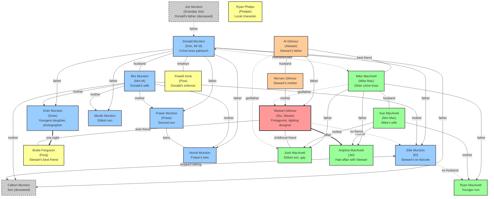

There's a lot of positive and negative discussion happening about AIs at the moment. I have thoughts - lots of them - and I want to blog more, mostly about coding tools. But I don't have the time!

But some small experiments still blow me away - and are worthy of a quick post.

So, I finished reading the Iain M Banks book [Stonemouth](https://en.wikipedia.org/wiki/Stonemouth) last night - it's a complex story with a lot of characters, and I mostly kept track, but to be honest I got lost in a few minor characters - it doesn't help that I read in small chunks at bedtime!

But I thought - "I wonder how an LLM could handle this amount of text - could it process it? Work out names, relationships, all of that?" - so I asked it.

I had the book as a `.mobi` kindle file - with DRM removed - so I could get it into markdown, which seemed a nice clean format for analysis, using [Calibre](https://calibre-ebook.com/) and [Pandoc](https://pandoc.org/):

```sh
<calibre app path>\ebook-convert Stonemouth.mobi Stonemouth.epub
pandoc Stonemouth.epub -f epub -t gfm-raw_html -o Stonemouth.md
```

Then I made a new project in the Claude desktop app, and added the Markdown file as project knowledge.

Then I asked:

> In the provided book Stonemouth, please analyse all the characters - note some have multiple names like "Ferg" whose full name is "Bodie Ferguson"
And try to work out the relationships - some are parents / children / siblings, some have brief affairs, some get married or almost get married.
Can you build a graph of the people, including any alternative names and a one-line summary of their role in the book, and all their relationships to other characters?
And then output that graph both as a json file for further analysis, and a mermaid.js rendering for viewing. ultrathink

And - it mostly worked! Really the only problem was that the output had pretty massive spoilers for the end of the book, that would totally ruin it for people new to the book, so I added:

> that's great - but can you make a second version that avoids spoilers near the end of the book - so doesn't show that &lt;examples removed&gt;

And it produced the following diagram (note - it _still_ gives away a fair bit of the plot - the book slowly reveals facts, so this is still fairly spoiler-y)

**⚠️ SPOILER WARNING** — The content below contains minor spoilers for *Stonemouth*. If you haven't read the book yet, stop here!
{: .notice--danger}

**Update** I realised, after first posting this, that I could use subgraphs - as documented in an earlier blog post - to make this clearer!

So I added another request:

> can you put the families in a hidden subgraph, so each family is kept together? See <https://blog.korny.info/2025/03/14/mermaid-js-revisited> for some syntax

(the originals are now at the bottom of this post)

```mermaid
graph TB
    %% Murston Family
    subgraph murston[" "]
        Donald["Donald Murston<br/>(Don, Mr M)<br/>Crime boss patriarch"]
        Joe["Joe Murston<br/>(Grandpa Joe)<br/>Donald's father (deceased)"]
        MrsM["Mrs Murston<br/>(Mrs M)<br/>Donald's wife"]
        Ellie["Ellie Murston<br/>(El)<br/>Stewart's ex-fiancée"]
        Grier["Grier Murston<br/>(Gree)<br/>Youngest daughter, photographer"]
        Murdo["Murdo Murston<br/>Eldest son"]
        Fraser["Fraser Murston<br/>(Frase)<br/>Second son"]
        Norrie["Norrie Murston<br/>Fraser's twin"]
        Callum["Callum Murston<br/>Son (deceased)"]
    end
    
    %% MacAvett Family
    subgraph macavett[" "]
        MikeMac["Mike MacAvett<br/>(Mike Mac)<br/>Other crime boss"]
        Sue["Sue MacAvett<br/>(Mrs Mac)<br/>Mike's wife"]
        Josh["Josh MacAvett<br/>Eldest son, gay"]
        Jel["Anjelica MacAvett<br/>(Jel)<br/>Had affair with Stewart"]
        Ryan["Ryan MacAvett<br/>Younger son"]
    end
    
    %% Gilmour Family
    subgraph gilmour[" "]
        Al["Al Gilmour<br/>(Alastair)<br/>Stewart's father"]
        Morven["Morven Gilmour<br/>Stewart's mother"]
        Stewart["Stewart Gilmour<br/>(Stu, Stewie)<br/>Protagonist, lighting designer"]
    end
    
    %% Others
    subgraph others[" "]
        Powell["Powell Imrie<br/>(Pow)<br/>Donald's enforcer"]
        Ferg["Bodie Ferguson<br/>(Ferg)<br/>Stewart's best friend"]
        Phelpie["Ryan Phelps<br/>(Phelpie)<br/>Local character"]
    end
    
    %% Family Relationships - Murston
    Joe -.->|father| Donald
    Donald ---|husband| MrsM
    Donald -->|father| Ellie
    Donald -->|father| Grier
    Donald -->|father| Murdo
    Donald -->|father| Fraser
    Donald -->|father| Norrie
    Donald -->|father| Callum
    MrsM -->|mother| Ellie
    MrsM -->|mother| Grier
    MrsM -->|mother| Murdo
    MrsM -->|mother| Fraser
    MrsM -->|mother| Norrie
    MrsM -->|mother| Callum
    
    %% Family Relationships - MacAvett
    MikeMac ---|husband| Sue
    MikeMac -->|father| Josh
    MikeMac -->|father| Jel
    MikeMac -->|father| Ryan
    Sue -->|mother| Josh
    Sue -->|mother| Jel
    Sue -->|mother| Ryan
    
    %% Family Relationships - Gilmour
    Al ---|husband| Morven
    Al -->|father| Stewart
    Morven -->|mother| Stewart
    
    %% Romantic/Sexual Relationships
    Stewart -.->|ex-fiancé| Ellie
    Stewart ==>|affair| Jel
    Ellie -.->|ex-husband| Ryan
    Grier ==>|one night| Ferg
    
    %% Friendships
    Stewart ---|best friend| Ferg
    Stewart ---|childhood friend| Josh
    Al ---|best friend| MikeMac
    
    %% Business/Crime Relationships
    Donald ---|employs| Powell
    Donald <-.->|rival/associate| MikeMac
    
    %% Godparent Relationships
    Al -.->|godfather| Josh
    MikeMac -.->|godfather| Stewart
    
    %% Sibling tensions
    Ellie x--x|stopped talking| Callum
    Fraser ---|twins| Norrie
    
    %% Styling
    classDef protagonist fill:#ff9999,stroke:#333,stroke-width:3px
    classDef murstonStyle fill:#99ccff,stroke:#333,stroke-width:2px
    classDef macavettStyle fill:#99ff99,stroke:#333,stroke-width:2px
    classDef gilmourStyle fill:#ffcc99,stroke:#333,stroke-width:2px
    classDef deceased fill:#cccccc,stroke:#333,stroke-width:2px,stroke-dasharray: 5 5
    classDef other fill:#ffff99,stroke:#333,stroke-width:2px
    classDef subgraphStyle fill:#f9f9f9,stroke:#333,stroke-width:2px
    
    class Stewart protagonist
    class Donald,MrsM,Ellie,Grier,Murdo,Fraser,Norrie murstonStyle
    class MikeMac,Sue,Josh,Jel,Ryan macavettStyle
    class Al,Morven gilmourStyle
    class Joe,Callum deceased
    class Powell,Ferg,Phelpie other
    class murston,macavett,gilmour,others subgraphStyle
```



Here's the [diagram in the mermaid online playground](https://www.mermaidchart.com/play?utm_source=mermaid_js&utm_medium=editor_selection&utm_campaign=playground#pako:eNqVV91u2zYUfhXCRbEWoBdgQS8StAGSNslWzF0R72ZYdkFTlMWFJg2SSmzMe6A9x15shzyURUp2uihARPHwfDy_H-m_JtxUYnI-WVq2bsivV_eawPP6NZm11nmjyQ1bSbXFadcucN0Khb_fT8j95A8UhueT0UxVMI2DDuT9wp5cvIE5SmaWzN7G749WrgRZGOfImnkrmeVNAfbZCECC_yXMrWW6WrMgRiDc6ztHauYbYcmbSnDBnKjeFnAz62aAB68SL04MkJ5kLQrla6VksCa-S_1rhcpzL56Y9aAtNtNaMs3__acEubVSWACJ76FTInnzm2n1UjhPKtYuGy8sJevGeBMDL2zpUmsrE3wK7wLwWlUBwxldKNxYiEswAQelDXEu-SK40dVI_YuxNoYBB4U6IoL3_kmWWh-ZUu0KtHBQaM2hwg7kS-gKB305Mn75KLw_Uo-MsyAdFeRMPghQDTGC0R4lZT5Noc-_xOLh-6oscOZtcBv-DyFC8XQIAe9Q8Xw2romV7JpSvc8SJUu2LZWEAp1L_adQkrPBtiDELX9kFWF1zaSFbX1DUhEWSHdbFjo1vEoYLDVbpHkc-VupVqa1hwO_ROEo7pfReNUpo9WXijkPpg77Bfu2zJuxjyJYjYMCp1dcmZFiEoZk4ag0Ye5bGtfIVOlfrfFsabR0nhIloeOkXhJIi1zqDHocllgubhCOaI8bReOreRIqRAQH5KcVdA8aBDMD7hG6NpYP3LoRdgn6V6aCtgsfrdu3LXwNI7oIZVXDJmB2YUgj1Dp2cKyG-OmSIShCpJ8NZ4rwhlnG_bNhwKogd0IxL412jVw7Mu16HJcFCp9-P73YYaJ36ZhAYTopptPprmndArh9F6l6IO2VIwUflUZuPSqNRHlUihR2VIykd1SM7Ibi4EAUYoUWRo9kmckjWWbwSJabOxLmxo6EuanfzGRijASFfFqmC2hxKO3DEljvGalQx4WhRlEaiDd3oAcdSTrAoaAH-5bHiTBwGXBYWZqRjzJZb27HvbonsMKCQr434s6smPaSn8zFpoWmK6xJriQmiz3UXy6KqurWfPhwscMDIYsF3lo69b0vfUjwRhJ0jRZEBxrcRZoZRixSyiHTIEYZ6eTK-RLeSFU1xlT7dX0mU6QLlFQVAyuuWie1cO4Er5AHIpaRilitldm6XSLhQv4-hsTKR6ZOmHOGS-bFsV1vDdw6rdD-0IbB-IC1NNUzhT9Ycbgg5nKhwhnkhXZhkzyFm-l0swNiXa9FRTxTD7CwbOd0sQueh4uYK5mg38Rvwyb4zeFcdp9ETdb9YUhqqdT5q7o-g4c6b82DOH91enqaxtMnWfnm_HS9GWCknwZhA5FAzs44r-vjID-MQdJ9rkQJxrwEJV1OcpC65vxlIN3lNAHw-DwL0E1UzMEBatn2nLwj7wawkRP2Rr3Us-7CUbh2Fv7-B0qGtW_OLPO5GPuEhgOExgqkkSloPJYo1hpNPwbyxOcYqfopEDINPUGBlmi8fhRZzlUuFU38macwXwFXCpp-TnQJysXY6zSQEE0XG4x4vigZTDszaNqM4i2uDPLk7_8APDr8zQ) though I don't know how reliable it is in the long term.

And a png version of the image in case mermaid doesn't render well:


And you can download [the raw mermaid file here](/assets/images/2025-06-27-stonemouth/stonemouth_subgraph.mmd)


Honestly, this is science-fiction land (even though this is Iain M Banks not Iain Banks) - stuff like this would have been unimaginable a few short years ago.

I do think we need to beware of the risks - AI hype is ludicrous, there's a huge bubble risk in the unsustainable amounts of money being poured into these tools, and the tech [broligarchy](https://broligarchy.substack.com/) (thanks [Carole Cadwalla](https://substack.com/@carolecadwalla) for the term!) that are behind all this.

But still, where it works and doesn't make stuff up, it can be pretty impressive. (I did check the graph represents, as far as I can tell, the book! It'd be quite ironic if it had mistakes and I didn't see them - I'll leave that as a task for the reader)

## Original diagram

This is the original posted diagram before I added subgraphs.




And [the original diagram in the online Mermaid playgroun](https://www.mermaidchart.com/play?utm_source=mermaid_js&utm_medium=editor_selection&utm_campaign=playground#pako:eNqVVl9v2zYQ_yqEi2ItIC_Agj4kaAM4aZqtmLsg3suw7IGhKIkLTQokldiY94H2OfbFduRREinb6eoHi-Lxfne8Pz_dXzOmSz47n9WGtg359fJeEfi9fk2WVChy1VBDmePG4v7K8Wdq3O_3s7giN0KudWfeP5iTizcr1xXhjOBvw86t0Y7WWgnrCiJF3TihalJyK2rFzf3sD4S9llJwAA1PsuyMdVoh5LVEpGjvO0v4Zl4Jqti___AB4BM3Nehf6hL0_UtnewD_NoV44NaRygiuygFivDiaJ5_oWsgtbn_UisoSLOAidxH2CrI0ZIlmroxYc_KgrSUtdUZQw5rBymft7wn_OcSNoapsqRcjCNoBVyvqGm7Im5IzTi0v3w5QS2OXgAWPHCtsTFCeRTUG6wYubkAzPKd-8OjAb7pTtQ9TSTtIGzcFaRvtdKiTJHWgXmrvhn9mYNey9PqQiDFNBq7gTeMitx32YqY406rMVL9oY0KN4CJTRTS4pnsWo8YVlbJbgwYuMo0V5PdASJPiZ4sn7lxWBEvxyEHgLwur4UyMetzCC_wSksaGShgsrDp_B_ifqvuk9doea5q0z9o2oXJsk6uOYS5ITbejApdwfqH-5FIwOjEHQjT1Iy0JrSoqDJhzTd_gA8rdliqA8Y8cAuvDZDkawhdJIYveIrgjc8JYSGodGJ82KFb9WGTaPHHvBy4yjFFprTOlwZuQjEhgt_qZS-8JLshPaygm9AV2Jl3DVaUNSyBvGy7bUIUhIOHVRm0UIcLPmlFJWE-e-y5hYMgdl9QJrWwjWkvmfYkOVEHm388vdhiMXSShlJDIfD7fNZ19APbYBUKYSEflQK1HpYEKjkpDbx-VYvcdFWO_HhVjc46MFoSYyczpPVni8p4scXhPlrq7J0yd3ROmrn41k7FXMubI0wUkMJWOYfF9_oKUy-NCX5oD2WQXGEH3JD3gVDCCfe3GsSf7Zp-UZujbRDa62zNO0uiZB5l8cOJOr6lygp2s-KaDXsu8yWYV7KFxaMiqqj_z4cPFDmkwiQVOI736cJcxJPgB9bpacaL8eLML08c0YmHSOOQaxCiZRVLl9AhrhCwbrcvh3JjJGOkMJVbFxIvLzgrFrT3BAeVAxBJS4etW6q3dRcLM5O9DSIx4ovKEWquZoI4fs3qjYa4xXLlDBr3zHqvW5QuFPzlxuCBW4kH62dJxZb2RNIWb-XyzA2JtW14SR-UjHMzbOc4j_uZ-hrA5E4xG3NYbwXcG3y77kVekHYdcUgkpz19V1Rn8CuuMfuTnr05PT-N6_ixK15yftpsJxjoOnah_dsZYVR3X_2FfnzIaBpYewLvwLQB1_GT3F2Ds2_T7YSoCsPB7EaDfKKmFD6Wh23PyjrybwAYSGJz6n5dKMIY-SpKUirGkC8_1RSiWIjR1Eb4gBZZFEUfOdfp1RvVYowXQZuErtwDyKMJs0CckPb2QRSS4OiVLFMLnvoiTah_LVIx9WHiCKOKsgcGZ_f0faAuQ7w)
