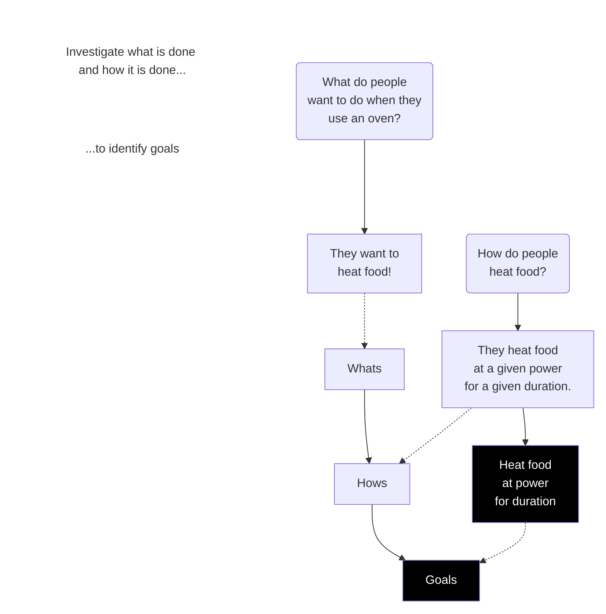

I had a shower thought the other day - "I'm an ebook hoarder, I have a bunch of technical ebooks as mobi/epub files, but also pdfs.  It'd be nice to be able to slurp them up into LLM tools - for summarizing, for categorising and the rest".  I'd already done epubs (see my recent [Stonemouth analysis](/2025/06/27/analysing-stonemouth-with-llm)) so PDFs should be not too hard?

It turns out PDFs are surprisingly complex - they often aren't linear documents at all, they are very display/print oriented - and things that appear simple like tables are actually just text in positions that looks table-like.  Ditto columnar text or any other fiddly layout.  And of course every technical PDF is full of diagrams.

This post won't go into all the complexities - I'm no expert and this was more a fun "how do I get the data I want?" question than something I put a lot of time into.

But it boils down to - you can do this the easy way, and get poor (but maybe good enough?) results - or the hard way and get great results, very slowly (or maybe expensively)

I should note I'm only really dealing with PDFs that are digital-native - documents like technical books that are mostly text. A lot of the tools are full of OCR logic because a lot of older PDFs have scanned images of pages.  OCR is still needed for newer PDFs, as there is often text in graphical elements that is relevant - but it's not as essential.

## What did I try?

### Parsr

I started with [Parsr](https://github.com/axa-group/Parsr) from AXA Group (of all people! I knew some AXA folks in Melbourne back in the day). This is a quite complex document parsing toolkit that runs in a Docker container, and is pretty old - pre-LLM - I'm not quite sure why I tried this in hindsight; it got a lot of google hits I guess, and is a good example of what parsing PDFs was like before generative AI.

I ran Parsr via docker and the web UI - it was pretty straightforward:

```sh
docker run -p 3001:3001 axarev/parsr
docker run -t -p 8080:80 axarev/parsr-ui-localhost:latest
```

I didn't record how long this took, but it was slow, but nothing as slow as Marker (below).

The output ... wasn't great.  Just looking at it, it had obvious problems like chopping letters off the start of paragraphs.  Colour me unimpressed.

### Marker

Next I tried [Marker](https://github.com/datalab-to/marker), which is a lot more modern, and quite complex and powerful.  It had the nice feature of being able to plug in an LLM, including free ollama LLMs, to do the complex interpretation of things like images and tables.

I won't go through all the ollama setup, but the gist of what I ran was:

```sh
uv init # setting up a local uv project
uv add torch torchvision
uv add marker-pdf

uv run marker_single my_pdf_file.pdf \
    --use_llm \
    --llm_service marker.services.ollama.OllamaService \
    --ollama_base_url http://localhost:11434 \
    --ollama_model gemma3 \
    --output_dir my_pdf_file \
    --output_format markdown \
    --disable_image_extraction
```

This took _forever_ !  And it was very slow to show progress, and logs were minimal.  For quite a while I assumed it had crashed, and gave up and used Python (see below) - but I went back and tried again, and realised it _was_ working - but glacially slowly.  I left it running overnight - the eventual time to process a 12MB technical ebook was 15 hours!!!

It's quite possible this was due to the limitations of free LLMs.  I used the gemma3 model, I want to try other models that might be faster; but having spent 15 hours waiting, I'm not in a rush to benchmark others.

It's probably a _lot_ faster to use a paid LLM, sadly my Claude Code license seems to come with severe rate limits for the underlying Anthropic APIs, so I couldn't really try that.

The output, however, was great.  More on that later

**UPDATE** I tried a different model - the new [gemma3n model](https://ollama.com/library/gemma3n) "for efficient execution on everyday devices" - and it was drastically faster.  Under 3 minutes. So there must have been some massive bottleneck using gemma3?  But - the gemma3n output had some major flaws - hallucinations in tables, for instance!  I need to investigate this more when I have time.

### PyMyPDF

Finally, I tried a Python library - a bit of digging suggested [PyMuPDF](https://pymupdf.readthedocs.io/) which is very popular and has a specific [PyMyPDF4LLM](https://pymupdf.readthedocs.io/en/latest/pymupdf4llm/index.html) model for LLM use.

I wrote (well, Claude mostly wrote) a very simple script:

```python
#!/usr/bin/env -S uv run
# /// script
# requires-python = ">=3.8"
# dependencies = [
#     "pymupdf4llm",
# ]
# ///
import sys
import pathlib
import pymupdf4llm

def convert_pdf_to_markdown(pdf_path, output_path):
    md_text = pymupdf4llm.to_markdown(pdf_path)
    pathlib.Path(output_path).write_bytes(md_text.encode())
    return output_path


def main():
    pdf_file = sys.argv[1]
    output_file = sys.argv[2]
    convert_pdf_to_markdown(pdf_file, output_file)

if __name__ == "__main__":
    main()
```

(Claude's script had more logging and error checking, I've trimmed it down for this blog)

This was very fast by comparison with the others - the same 12MB file took 28 seconds to convert!

The output wasn't _great_ - but it was probably fine for LLM summaries, if you don't mind losing some sense of the content of tables, and skipping images almost entirely.

## What did I use as a test document?

I used ["The Design of Web APIs" by Arnaud Lauret](https://www.goodreads.com/book/show/38396693-the-design-of-web-apis) as my test document. The choice was somewhat random - I had it in my ebook collection, and it seemed like a good mix of text, diagrams, code samples, and tables that would test the various parsing tools.

The PDF was 12MB in size, with 396 pages and a nice mix of text, diagrams, code snippets and tables.

## Output comparison

### Basic text

Basic text shouldn't be too hard, you'd think.  Here is a sample from the ebook:


**Parsr** handled this relatively OK, but it didn't handle words split by a line ending at all well:

```text
What do people do when they shop online? Well, they buy some products. And how do they buy these products? They add them to their shopping cart and then check out. Nothing new for these two frst questions. Let’s now dig into each step to determine its inputs and outputs.  
We’ll start with the add products to the cart goal. What do people need to add a prod- uct to a cart? They obviously need a product and a cart. Good, and do they get some- thing in return when they add a product to their cart? No. Well, these new questions do not seem to give us any really useful information; the answers are quite obvious. Maybe we will get something more interesting for the check out step  
```

Also, it couldn't read the word "first"! "Nothing new for these two frst questions" - I guess "first" was using a ligature that the parser didn't understand?

**PyMyPdf** and **Marker** both handled hyphenated words at line endings successfully - but both also stumbled on "frst".

(I won't include samples as they are basically the same as the above, but with "product" and "something" as single words)

### Code snippets

All the tools did a decent job of recognising code snippets - I think they tend to be in a monospace font which makes recognising them easier.

### Tables

Tables are fiddly as they aren't stored as tabular info in the pdf, just as text with positions:


**Parsr** didn't cope well with the row separation:

| HTTP method | Action |  
|---|---|  
| POST (and PUT in creation) GET PATCH/PUT DELETE | Create a customer, add a meal to a menu, order goods, start a timer, save a blog post, send a message to customer service, subscribe to a service, sign a contract, open a bank account, upload a photo, share a status on a social network, and so on Read a customer, search for a French restaurant, find new friends, retrieve opened accounts for the last 3 months, download a signed contract, filter best selling books, select black-and-white photos, list friends, and so forth Update a customer, replace goods in an order, switch plane seat, edit an order’s delivery method, change an order’s currency, modify a debit card limit, temporarily block a credit card, and so on Delete a customer, cancel an order, close a case, terminate a process, stop a timer, and so on |  

**Marker** did much better:

| HTTP method                   | Action                                                                                                                                                                                                                                                       |
|-------------------------------|--------------------------------------------------------------------------------------------------------------------------------------------------------------------------------------------------------------------------------------------------------------|
| POST (and PUT<br>in creation) | Create a customer, add a meal to a menu, order goods, start a timer, save a blog post,<br>send a message to customer service, subscribe to a service, sign a contract, open a bank<br>account, upload a photo, share a status on a social network, and so on |
| GET                           | Read a customer, search for a French restaurant, find new friends, retrieve opened<br>accounts for the last 3 months, download a signed contract, filter best selling books,<br>select black-and-white photos, list friends, and so forth                    |
| PATCH/PUT                     | Update a customer, replace goods in an order, switch plane seat, edit an order's delivery<br>method, change an order's currency, modify a debit card limit, temporarily block a credit<br>card, and so on                                                    |
| DELETE                        | Delete a customer, cancel an order, close a case, terminate a process, stop a timer, and<br>so on                                                                                                                                                            |

**PyMyPdf** was similar to Parsr

|HTTP method|Action|
|---|---|
|POST (and PUT<br>in creation)<br>GET<br>PATCH/PUT<br>DELETE|Create a customer, add a meal to a menu, order goods, start a timer, save a blog post,<br>send a message to customer service, subscribe to a service, sign a contract, open a bank<br>account, upload a photo, share a status on a social network, and so on<br>Read a customer, search for a French restaurant, fnd new friends, retrieve opened<br>accounts for the last 3 months, download a signed contract, flter best selling books,<br>select black-and-white photos, list friends, and so forth<br>Update a customer, replace goods in an order, switch plane seat, edit an order’s delivery<br>method, change an order’s currency, modify a debit card limit, temporarily block a credit<br>card, and so on<br>Delete a customer, cancel an order, close a case, terminate a process, stop a timer, and<br>so on|

### Images

Images it turns out seem to get processed in a few ways depending on the content; and also the tools. **Parsr** was configured to generate markdown with images, so it sometimes tried to interpret images, and sometimes just copied them - this makes some sense, as if the image is actually a table you'd prefer it to be turned into markdown.

Whereas **PyMyPdf** didn't really have any explicit handling for images, it would just try to parse them as text; and **Marker** with the `--disable_image_extraction` parameter tried to replace images with descriptions if they weren't otherwise identifiable.

I'll split images into a few key types as they get handled quite differently:

#### Diagrams

Diagrams have text and boxes in them - the results were a bit of a mixed bag.


**Parsr** tried to just turn it into text, and didn't do so well - but it's still better than the others in this case:

```markdown
What do people want to do when they

How do people use an oven?

heat food?

They heat food  
Heat food They want to  
at?a given power  
at power heat food!  
for a given duration.  
for duration

Whats Hows Goals

Investigate what is done and how it is done...  
...to identify goals
```

**Marker** actually failed to process this one at all.  In other cases it did OK with text descriptions, but never great.  This was possibly a limitation of the free LLM it used.

**PyMyPdf** also did pretty badly:

```markdown
What do people

Investigate what is done and how it is done... ...to identify goals
```

Interestingly, I asked **Claude Code** to process this same image into a mermaid.js snippet - it'd be very cool to have a pdf parser that could do this, when appropriate:



#### Screenshots


**Parsr** just saved this as an image - probably the best option for a mixed markdown-and-images output.

**Marker** made a table - this is a decent effort, though given the limitations of markdown tables it couldn't really make it work. You can also see the limitations of OCR on small text:

| Q Search                            | Create a money transfer                                                                                                                                                                                |  |
|-------------------------------------|--------------------------------------------------------------------------------------------------------------------------------------------------------------------------------------------------------|--|
| Authentication                      | This operation allows one to transfer an amount of money from a source account to a destination account. There are three different types of                                                            |  |
| Transfers<br>$\checkmark$           | money transfer:<br>• Immediate -- these are executed as soon as the request is received                                                                                                                |  |
| <b>POST</b> Create a money transfer | • Delaved - these are executed upon a given future date<br>· Recurring - these are executed a given occurrences number of times at a given frequency - the first occurrence being executed immediately |  |
| <b>COL</b> List money transfers     | or at a given date                                                                                                                                                                                     |  |
| <b>CIT</b> Get a money transfer     | BankingAPIScopes (transfericreate, transferiadmin)<br><b>AUTHORIZATIONS</b>                                                                                                                            |  |
| Cancel a money transfer             | REQUEST BODY SCHEMA: application/json                                                                                                                                                                  |  |
| <b>Beneficiaries</b>                | string 15 characters /^\d{15}\$/<br>source<br>required<br>Source account number                                                                                                                        |  |
| Accounts                            | destination<br>string 15 characters /^\d{15}\$/<br>required<br>Destination account number                                                                                                              |  |

**PyMyPdf**, unsurprisingly, didn't even try with this one.

#### Photos


**Parsr** naturally just saved this as an image.

**Marker** did ... poorly:

```markdown
Image /page/22/Picture/1 description: A bar chart titled "Fruit Preference Survey" is shown. The x-axis shows the types of fruits, and the y-axis shows the number of people. The bar chart shows that most people prefer apples, followed by bananas and oranges. 20 people prefer apples, 15 people prefer bananas, and 10 people prefer oranges.
```

I guess the LLM misinterpreted the books and turned them into a barchart hallucination? Not so good, gemma3 model.

**PyMyPdf** didn't even try to handle the image.

**Claude Code**, by comparison, did a great job - so Marker with a commercial LLM would probably produce something similar:

```text
This is a photo of a man with glasses and a beard, wearing a dark blue
  t-shirt with "RESPECT API GUIDELINES" text on it. He's standing in front
  of a white bookshelf filled with technical books and what appears to be
  board games. The person appears to be in a home office or study setting.
```

## Conclusion

This was a kind-of fun digression.  I think it's pretty clear though that I have basically two (or three?) options here:

1. If I just want an LLM to summarize an ebook that is mostly text, PyMyPdf is _fine_.  It's fast, easy, and there's enough context for it to work with.
2. If I want a full markdown version of an ebook, for detailed analysis or copying sections to Obsidian or something, it'd be worth using Marker - though maybe not with the "images as descriptions" setting.
   - Using a free ollama LLM can be fine if I have lots of time, don't mind some spurious descriptions, and can fiddle models / time.  (this needs investigation)
   - But maybe if I wanted something higher quality, it'd be worth using it with a commercial LLM.
