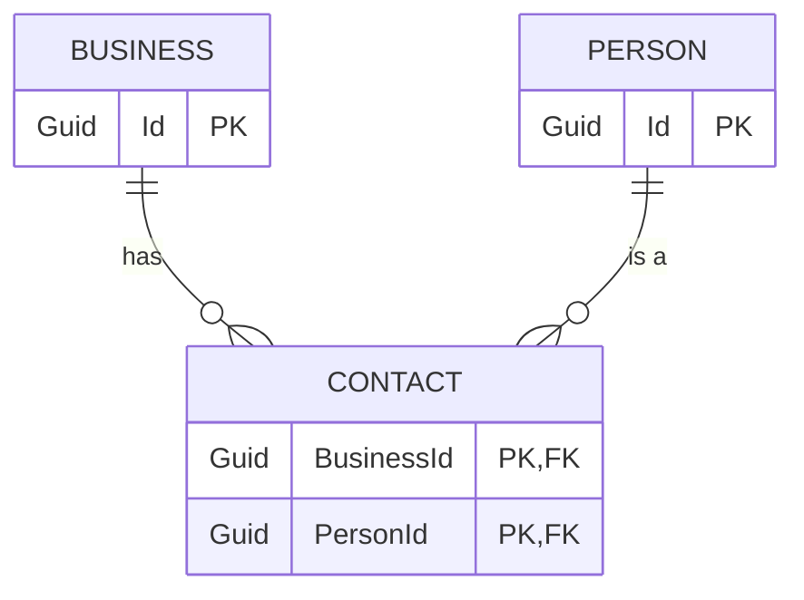

I thought it'd be worth posting an example of a bigger task I did the other day - just to show what can be done, without crazy vibe-coding, on a non-greenfields app, using ASP.Net Core not some simplistic front-end tooling.

This was originally part of a longer post but I thought it was worth splitting - this example is used in my post [Clowns to the left of me ...](/2025/07/19/clowns-to-the-left-of-me)
{: .notice}

## The task - Sending a message when data changes

We have an ASP.Net core application which includes a relationship between Businesses and People, where that relationship is modeled as a collection of Contacts:



Note that I have configured a lot of context in `CLAUDE.md` and linked files, including things like project structure, idioms, how to run tests, MCP servers to use, and more. The context helps a lot, but is a bit too much detail for this post.
{: .notice}

I started prompting Claude Code with

> How do we currently trigger sending Kafka events?

This was more for my understanding than anything, but also meant Claude loaded up more on the code structure - everything it has seen in a session so far makes up its context, so having this knowledge helps with the next stage.

Then the main prompt:

> "OK - I'd like to add a specific kind of event - but only when a relationship between a Business and a Contact changes. If a Contact is added to a Business, or removed from a Business, we need to send an event of type PersonBusinessLink which is defined in these classes:

```csharp
  namespace Liberis.Events.ThisProject
  public record PersonBusinessLink()
  {
    public string? PersonId { get; set; }
    public string? BusinessId { get; set; }
    public PersonBusinessLinkType Type { get; set; }
  }

  public enum PersonBusinessLinkType()
  {
    PersonBusinessLinked,
    PersonBusinessUnlinked,
  }
```

> these events should be generated with the type PersonBusinessLinked if a person is added, and PersonBusinessUnlinked if a person is removed - note this mimics the existing Contact domain entity which links a Business to a Person.

I pasted in the classes because they are generated from protobuf schemas in another project and I don't think Claude has access to the decompiled code - it'd be interesting to work out if it could be taught to read it.

## Claude's first attempt

Claude churned away for a while - and produced a quite good first pass; it modified

- The Business service when a business was created, or modified, or patched
  - more on this below
- a new Domain type was added for `PersonBusinessLinkType` (following project conventions)
- a new Mapper method was added which took a `Contact`, a `businessId` and a `PersonBusinessLinkType` and generated a Kafka message
- a new Kafka topic was added "person-business-link" - this was a guess on Claude's part, and not quite right
- a new handler was added to our KafkaEventDispatcher to dispatch messages to the right topic based on the new event type
- the Dispatcher was injected into the BusinessService

### Course correcting not vibe coding

I should note, I didn't just leave Claude going - you don't want to let it go too far off piste[^1], so I kept an eye on changes. I have it set up to ask me before every change, so when it chose the wrong Kafka topic I said "no" to the proposed change, then told it the right topic, and it kept on going.

[^1]: yet again, follow the mantra 'treat the LLM like a very fast keen naive junior developer with lots of resources but no long-term knowledge'

Sometimes on simple tasks I let it do more steps without checking, but that means more work cleaning up later; this is one of the interesting learning exercises working this way, determining when to be slow and careful, and when to be fast but need more clean-up effort later.

These are the sorts of corrections I had to make:

- "I think you should use the business ID as the partition key" as it chose the wrong key
- "We should dispatch events before committing the unit of work, so the outbox pattern works"
- "This should be in the namespace Foo.Bar as that's where other similar things are"
- "You don't need to log anything here, our dispatcher has observability built in"
- "Please don't add that comment - only comment on things that aren't obvious"

In all these cases though, I didn't need to write any code, I just guided it occasionally, like I would a junior developer. One who loves comments and logging and excess documentation!

(You can train it out of some of these things, using more initial context - but some habits are harder to shift than others)

### Fixing a bigger problem

I did catch it making one mistake - our method to patch a business follows roughly this logic:

- Start a transaction
- Find the business
- Patch the business, returning the updated complete business object
- ... some extra logic around related data that might have changed
- Commit the transaction
- Return a success payload

The code Claude wrote was roughly:

- Start a transaction
- Find the business
- Patch the business, returning the updated complete business object
- ... some extra logic around related data that might have changed
- **Check for dispatching person/business updates:**
  - **Fetch the original unchanged business**
  - **Check whether the original business had added/removed people compared to the new one**
  - **Dispatch any changes**
- Commit the transaction
- Return a success payload

This would probably work, (assuming we could read the pre-transaction data), but was doing unnecessary work. I asked Claude:

> Can't we get the original business contact info earlier in the method, rather than at the end?

And it tried - quite hard - to do this. The trouble is, we aren't performing the logic above with procedural code - we use chained functions with monadic `Result` and `Option` return types, so the chain passes a `Result` wrapping either a `Business` or an `Error` payload, and errors get passed down the chain rather than using exceptions. (Or sometimes `Result<Option<Business>>` when a function like `FindBusiness` might return no business without it being an error) so the code is a bit harder for Claude to understand:

```csharp
var result = await businessRepository.FindBusinessAsync(...)
  .ThenAsync(businessToUpdateOption => businessToUpdateOption.Match(
    some: async businessToUpdate =>
    {
      // update the business and return the updated business
    }
    none: () => // no business so we had None - return a new Error result
  ))
  .ThenAsync(updatedBusiness => 
    // more business logic if the previous update succeeded
  )
  .ThenAsync(async updatedBusiness =>
    var originalBusiness = // logic to fetch the original business
    // the new kafka dispatch:
    await DispatchContactChangeEventsAsync(originalBusiness, updatedBusiness);
    await unitOfWork.CommitAsync();
    return Success(updatedBusiness);
  )
```

Claude actually _almost_ managed to fix this. It worked out that instead of passing `Result<businessToUpdate>` through the function chain, it should pass a tuple `Result<(originalBusiness, businessToUpdate)>` and re-threaded all the functions to match:

```csharp
var result = await businessRepository.FindBusinessAsync(...)
  .ThenAsync(businessToUpdateOption => businessToUpdateOption.Match(
    some: async businessToUpdate =>
    {
      // update the business and then
      return Result(businessToUpdate, updatedBusiness)
    }
    none: () => // no business so we had None - return a new Error result
  ))
  .ThenAsync(businessPair => 
    // destructure businessPair into (businessToUpdate, updatedBusiness)
    // more business logic if the previous update succeeded
  )
  .ThenAsync(async businessPair =>
    // the new kafka dispatch:
    await DispatchContactChangeEventsAsync(businessPair.Original, businessPair.Updated);
    await unitOfWork.CommitAsync();
    return Success(businessPair.Updated);
  )
```

But - it hit a syntax error. One of the error paths (not shown) was still returning `Result<Business>` not the tuple. It tried a few times to correct it, but it gave up and said "I think the logic is right but there are still a few syntax errors"

To its credit, I'd prefer this than it churning forever or hallucinating an incorrect result. I managed to fix it (with a bit of pain - we override `ThenAsync` in ways which make diagnosing this tricky even for a human) and then Claude could take over again.

## Testing

I really should have started with a test! I do have instructions in my context about testing, but neither Claude nor I did this in proper TDD fashion.

But when I asked

> Can you find an integration test that can test the new event? Just change one test for now to see if it is working.

Claude went away, found an integration test (we use Test Containers to test against dockerised Kafka) and modified it quite sensibly. It took a test that was roughly:

```csharp
[Fact]
public async Task UpdateBusinessAsync_UpdatesBusiness()
{
  // Arrange
  var businessRequest = ARandomBusinessRequest(...);
  var createBusinessResponse = await CreateBusinessAsync(businessRequest);
  var updatedBusiness = // logic to update the business including new People
  // Act
  var response = await UpdateBusinessAsync(updatedBusiness)
  // Assert
  var getBusinessResponse = await GetBusinessAsync(createBusinessResponse.Id);
  // lots of assertions
}
```

And made it
```csharp
[Fact]
public async Task UpdateBusinessAsync_UpdatesBusiness()
{
  // Reset shared state
  ClearReceivedKafkaEvents(Topics.PersonBusinessLink);

  // Arrange
  var businessRequest = ARandomBusinessRequest(...);
  var createBusinessResponse = await CreateBusinessAsync(businessRequest);
  var updatedBusiness = // logic to update the business including new People
  // Act
  var response = await UpdateBusinessAsync(updatedBusiness)
  // Assert
  var getBusinessResponse = await GetBusinessAsync(createBusinessResponse.Id);
  // same assertions as above then
  await WaitForConditionAsync(
    () => ReceivedKafkaEvents<PersonBusinessLink>(Topics.PersonBusinessLink).Count() >= 2);
  var linkEvents = ReceivedKafkaEvents<PersonBusinessLink>(Topics.PersonBusinessLink);
  // assert the link events match expectations
}
```

This was basically following the pattern of other tests - but Claude found that pattern, without prompting, in a different test file - Business tests didn't have any kafka tests at this stage. I was pretty impressed.

And then it ran the tests - and they failed. :)

At this stage Claude started thrashing - trying multiple things that I could see wouldn't help. So again, I stopped it, then sat down with the debugger and my weak human brain.

(It turns out that I also needed to add a new Producer in our kafka setup - an easy fix, once I found it)

And then the tests passed, Claude helped me add more similar tests for other endpoints, and the task was done.

### This isn't 10x speed - but it's not junk either

I wanted to post this example as it's a good midpoint between "AI can replace developers" and "AI is rubbish and produces junk". More on that in [my next post](/2025/07/19/clowns-to-the-left-of-me).

This worked, with some human guidance. It needed help - maybe with future improvements and better context it will need less help, but I doubt this kind of thing will "just work" any time in the near future. That test failure, for example, needed a lot of investigation a long way from the context of the code or the tests being written.

And I'm working in a similar way, and getting similar benefits, all over the place.

Sometimes the LLM actually works first time - I added a feature flag to our application to turn one feature off in some environments, and the code needed no checks at all. And it's _great_ at writing small simple on-demand scripts - things like "write a python script to graph our git commits over time" or "write a script to generate a Slack message showing our outstanding pull requests".

And sometimes it doesn't help at all - it's worth learning when to say "ok, this is too trivial / too hard" and writing it yourself.

There is _so_ much to learn here - when to use the tools, how to set up context, what MCP or other external information to bring in - and it's constantly changing.

But I'm finding it an exciting time - this stuff, used carefully, is very helpful, and a lot of fun.

## But don't forget the downsides

I feel I need a standard disclaimer at the end of any AI post. We need to remember the context behind these tools - there are giant tech companies pushing these hard into every corner of our lives. They are run by horrible tech [broligarchs](https://en.wikipedia.org/wiki/Broligarchy)[^broligarchy] whose interests are personal power and destabilising democracy, not helping the world.

They consume vast amounts of power, which due to our failure to charge for [externalities](https://en.wikipedia.org/wiki/Externality), mean they are burning fossil fuels, consuming scarce water, and accelerating the climate crisis. And there are many signs that the funding for this is [an unsustainable bubble](https://www.wheresyoured.at/subprimeai/) and the companies and tools may collapse, or start charging significantly more and/or enshittifying the experience of users.

[^broligarchy]: Thanks [Carole Cadwalla](https://broligarchy.substack.com/about) for introducing me to the very useful term [Broligarchy](https://en.wikipedia.org/wiki/Broligarchy)!