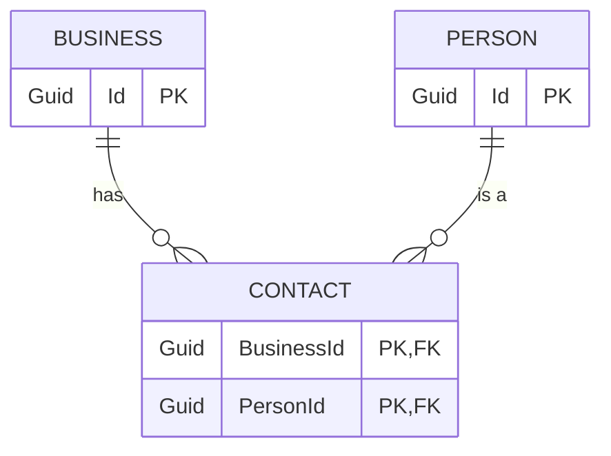

I thought it'd be worth posting an example of a bigger task I did the other day - just to show what can be done, without crazy vibe-coding, on a non-greenfields app, using ASP.Net Core not some simplistic front-end tooling.

## A sample real-world task - sending a message when data changes

We have an ASP.Net core application which includes a relationship between Businesses and People, where that relationship is modeled as a collection of Contacts:



Note that I have set up a fair bit of context in `CLAUDE.md` and linked files - some generated with Claude Code's `/init` command, some added by hand, including things like how we structure the project, using MCP servers for up to date library docs, and the like. The context helps a lot, but is a bit too much detail for this post.
{: .notice}

I started prompting Claude Code with

> How do we currently trigger sending Kafka events?

This was more for my understanding than anything, but also meant Claude knew a bit more about the code - everything it has seen in a session so far makes up it's context, so having dug into the code around a topic might have helped.

Then the main prompt:

> "OK - I'd like to add a specific kind of event - but only when a relationship between a Business and a Contact changes. If a Contact is added to a Business, or removed from a Business, we need to send an event of type PersonBusinessLink which is defined in these classes:

```csharp
namespace Liberis.Events.ThisProject
public record PersonBusinessLink()
{
  public string? PersonId { get; set; }
  public string? BusinessId { get; set; }
  public PersonBusinessLinkType Type { get; set; }
}
public enum PersonBusinessLinkType()
{
  PersonBusinessLinked,
  PersonBusinessUnlinked,
}
```

> these events should be generated with the type PersonBusinessLinked if a person is added, and PersonBusinessUnlinked if a person is removed - note this mimics the existing Contact domain entity which links a Business to a Person.

I pasted in the classes because they are generated from another project and I don't think Claude has access to the decompiled code - it'd be interesting to work out if it could be taught to read it.

Claude churned away for a while - and produced a quite good first pass; it modified

- The Business service when a business was created, or modified, or patched
  - more on this below
- a new Domain type was added for `PersonBuisnessLinkType`
- a new Mapper method was added (in the correct place) which took a `Contact`, a `businessId` and a `PersonBusinessLinkType` and generated a Kafka message
- a new Kafka topic was added "person-business-link" - this was a guess on Claude's part, and not quite right
- a new handler was added to our KafkaEventDispatcher to dispatch messages to the right topic based on the new event type
- the Dispatcher was injected into the BusinessService

I should note, I didn't just leave Claude going - like working with a junior developer, you don't want to let it go too far wrong, so I kept an eye on changes - I have it set up to ask me before every change, so when it chose the wrong Kafka topic I said "no" to the proposed change, then told it the right topic, and it kept on going.

These are the sorts of corrections I had to make:

- "I think you should use the business ID as the partition key" as it chose the wrong key
- "We should dispatch events before committing the unit of work, so the outbox pattern works"
- "This should be in the namespace Foo.Bar as that's where other similar things are"
- "You don't need to log anything here, our dispatcher has observability built in"
- "Please don't add that comment - only comment on things that aren't obvious"

In all these cases though, I didn't need to write any code, I just guided it occasionally, like I would a junior developer. One who loves comments and logging and excess documentation!

(You can train it out of some of these things, using more initial context - but some habits are harder to shift than others)

### Bigger fix needed

I did catch it making one mistake - our method to patch a business follows roughly this logic:

1. Start a transaction
2. Find the business
3. Patch the business, returning the updated complete business object
4. ... some extra logic around related data that might have changed
5. Commit the transaction
6. Return a success payload

The code Claude wrote was roughly:

1. Start a transaction
2. Find the business
3. Patch the business, returning the updated complete business object
4. ... some extra logic around related data that might have changed
5. Check for dispatching person/business updates:
   1. Fetch the original unchanged business
   2. Check whether the original business had added/removed people compared to the new one
   3. Dispatch any changes
6. Commit the transaction
7. Return a success payload

This would probably work, (assuming we could read the pre-transaction data), but was doing unnecessary work. I asked Claude:

> can't we get the original business contact info earlier in the method, rather than at the end?

And it tried - quite hard - to do this. The trouble is, we aren't performing the logic above with procedural code - we use chained with monadic `Result` and `Option` return types, so the chain passes a `Result` wrapping either a `Business` or an `Error` payload, and errors get passed down the chain rather than using exceptions. (Or sometimes `Result<Option<Business>>` when a function like `FindBusiness` might return no business without it being an error) so the code is a bit harder for Claude to understand:

```csharp
var result = await businessRepository.FindBusinessAsync(...)
  .ThenAsync(businessToUpdateOption => businessToUpdateOption.Match(
    some: async businessToUpdate =>
    {
      // update the business and return the updated business
    }
    none: () => // no business so we had None - return a new Error result
  ))
  .ThenAsync(updatedBusiness => 
    // more business logic if the previous update succeeded
  )
  .ThenAsync(async updatedBusiness =>
    var originalBusiness = // logic to fetch the orignal business
    // the new kafka dispatch:
    await DispatchContactChangeEventsAsync(originalBusiness, updatedBusiness);
    await unitOfWork.CommitAsync();
    return Success(updatedBusiness);
  )
```

Claude actually _almost_ managed to fix this. It worked out that instead of passing `Result<businessToUpdate>` through the function chain, it should pass a tuple `Result<(originalBusiness, businessToUpdate)>` and re-threaded all the functions to match:

```csharp
var result = await businessRepository.FindBusinessAsync(...)
  .ThenAsync(businessToUpdateOption => businessToUpdateOption.Match(
    some: async businessToUpdate =>
    {
      // update the business and then
      return Result(businessToUpdate, updatedBusiness)
    }
    none: () => // no business so we had None - return a new Error result
  ))
  .ThenAsync(businessPair => 
    // destructure businessPair into (businessToUpdate, updatedBusiness)
    // more business logic if the previous update succeeded
  )
  .ThenAsync(async businessPair =>
    // the new kafka dispatch:
    await DispatchContactChangeEventsAsync(businessPair.Original, businessPair.Updated);
    await unitOfWork.CommitAsync();
    return Success(businessPair.Updated);
  )
```

But - it hit a syntax error. One of the error paths (not shown) was still returning `Result<Business>` not the tuple. It tried a few times to correct it, but it gave up and said "I think the logic is right but there are still a few syntax errors"

To it's credit, I'd prefer this than it churning forever or hallucinating an incorrect result. I managed to fix it (with a bit of pain - we override `ThenAsync` in ways which make diagnosing this tricky even for a human) and then Claude could take over again.

### Testing

I really should have started with a test! I do have instructions in my context about testing, but neither Claude nor I did this in proper TDD fashion.

But when I asked

> Can you find an integration test that can test the new event? Just change one test for now to see if it is working.

Claude went away, found an integration test (we use Test Containers to test against dockerised Kafka) and modified it quite sensibly. It took a test that was roughly:

```csharp
[Fact]
public async Task UpdateBusinessAsync_UpdatesBusiness()
{
  // Arrange
  var businessRequest = ARandomBusinessRequest(...);
  var createBusinessResponse = await CreateBusinessAsync(businessRequest);
  var updatedBusiness = // logic to update the business including new People
  // Act
  var response = await UpdateBusinessAsync(updatedBusiness)
  // Assert
  var getBusinessResponse = await GetBusinessAsync(createBusinessResponse.Id);
  // lots of assertions
}
```

And made it
```csharp
[Fact]
public async Task UpdateBusinessAsync_UpdatesBusiness()
{
  // Arrange
  ClearReceivedKafkaEvents(Topics.PersonBusinessLink);

  var businessRequest = ARandomBusinessRequest(...);
  var createBusinessResponse = await CreateBusinessAsync(businessRequest);
  var updatedBusiness = // logic to update the business including new People
  // Act
  var response = await UpdateBusinessAsync(updatedBusiness)
  // Assert
  var getBusinessResponse = await GetBusinessAsync(createBusinessResponse.Id);
  // same assertions as above then
  await WaitForConditionAsync(
    () => ReceivedKafkaEvents<PersonBusinessLink>(Topics.PersonBusinessLink).Count() >= 2);
  var linkEvents = ReceivedKafkaEvents<PersonBusinessLink>(Topics.PersonBusinessLink);
  // assert the link events match expectations
}
```

This was basically following the pattern of other tests - but Claude found that pattern, without prompting, in a different test file - Business tests didn't have any kafka tests at this stage. I was pretty impressed.

And then it ran the tests - and they failed. :)

At this stage Claude started churning - trying a few things that I could see wouldn't help. So again, I stopped it, then sat down with the debugger and my weak human brain.

(It turns out that I also needed to add a new Producer in our kafka setup - an easy fix, once I found it)

### This isn't 10x speed - but it's not junk either

My point here is, this actually worked, with some human guidance. It wasn't perfect on its own - the LLMs need guidance to get it right, to avoid technical debt, to rescue them when they get stuck. But still, it sped up this work considerably for me - even considering the time I spent course-correcting.

It certainly isn't the "these never work and always hallucinate or produce garbage" take I hear from some people.

And this is a change touching several areas of a non-trivial codebase - I've seen LLMs do even better on simple things - changes to a small class, adding a feature flag, writing a python script to build a data visualization. They are _great_ at little utility scripts to solve a single problem that you throw away when you are finished.