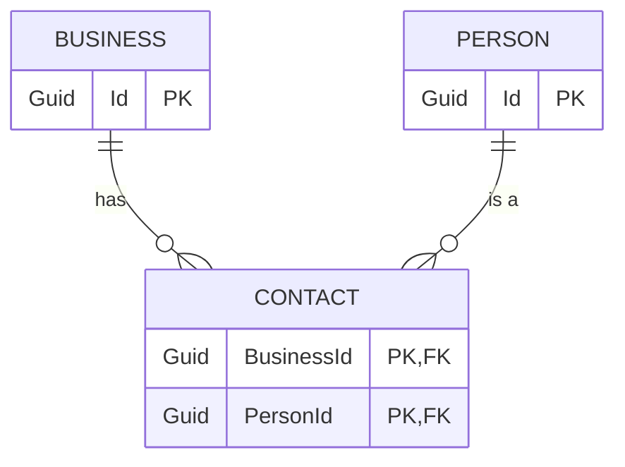

I've had the song "Stuck in the Middle with You" in my head for a few weeks. (R.I.P. Michael Madsen!)

[^1]

[^1]: Image from *Reservoir Dogs* (1992), directed by Quentin Tarantino. Miramax Films. Fair use for commentary and criticism.

But not because of Reservoir Dogs - but because of the public discussion about AI coding tools. (Yes, I know... feel free to walk away if you are sick of the whole thing).

I feel like there's this strange culture war, or something like it, playing out - with wild statements on both extremes - and I'm stuck in the middle.

### Hype To the left of me

There is just _so much_ AI Hype.

I'm talking here mainly about software development tools. There's plenty more ludicrous hype when it comes to other AI areas, but I'm trying to limit this to software engineering.

And the hype, as well as the naïveté, is extreme. You get people vibe coding their entire business applications. You get people claiming 50x speed improvements, or indeed "we don't need developers at all". You get people posting "I'm not a programmer but I used Copilot to build my entire product and it's awesome", with multiple variations of this. Online discussion forums seem to be full of highly risky advice - "I just turn on `--dangerously-skip-permissions`" or "use this MCP server which gives write access to your entire file system" or even worse.

Amusingly there's also quite a few comments like "oops I deleted my whole file system, what do I do now?" or "I'm not a programmer and I got Copilot to build my product but now I can't seem to get it to fix anything". There's some tasty schadenfreude here but I also feel a bit sorry for some of these people, where things started _so_ nicely, but now technical debt, AI slop, and a lack of the knowledge of what "good" looks like, are making it all fall apart.

A lot of the hype is just marketing - astroturfing from fake users, or less artificial direct marketing - "look at our amazing new IDE / platform / model, it has so much more data than the last one, it is reasoning now!"

A lot though seems to be genuine users lured by the quick result, the slick prototype, the dopamine hit of seeing all that code produced, without the boring course-corrections that feel like waste. Once you are high on the "look how much code I can make" drug, it's hard not to evangelise it to everyone else.

And as the last year or two have shown us, it's very easy for people to be fooled by LLMs, which excel at looking like something they are not. People anthropomorphise the tools all the time - "Why did you do this dumb thing? Can't you see the example I'm looking at of how to do it?" - they start to think this is genuine intelligence that can reason and learn, not a specific set of tools.

LLMs are wonderful machines that read your data and questions and produce results in a way that _feels_ like intelligence, but is actually just really clever pattern matching and a surrounding ecosystem of context sources and tools. Sometimes the results are amazing, occasionally they are terrible, and _you always need to check the results_ because the process is fundamentally nondeterministic, and just because 99% of the time something worked, there's always that 1% change it was confidently wrong.

### Skeptics to the right

On the other side - the anti-AI sentiment is also pretty wild.

I think most of these folks are well meaning - far more so than the pro-AI hypers; my sympathy is with the anti-AI folks in general. But they are also prone to jumping on hype - for one example the [Your Brain on ChatGPT](https://www.brainonllm.com/) paper, which is still in pre-print, not peer reviewed, and has had [some](https://theconversation.com/mit-researchers-say-using-chatgpt-can-rot-your-brain-the-truth-is-a-little-more-complicated-259450) [serious](https://www.changetechnically.fyi/2396236/episodes/17378968-you-deserve-better-brain-research) [criticism](https://www.globaleconomicnews.au/opinions/your-brain-on-chatgpt-a-forensic-takedown), still got a _huge_ amount of coverage, including [Time Magazine](https://time.com/7295195/ai-chatgpt-google-learning-school/) - this includes some classic moral panic language:

> Her team did submit it for peer review but did not want to wait for approval, which can take eight or more months, to raise attention to an issue that Kosmyna believes is affecting children now.

Oh my goodness, will nobody protect our children?!

Similarly the [recent study on experienced open-source developer productivity](https://metr.org/blog/2025-07-10-early-2025-ai-experienced-os-dev-study/) is being waved around to say "this proves they don't work" - the authors of the paper evidently expected this, and provided this table, which doesn't seem to get as much mention as their headlines:


And this interesting breakdown of likely contributing factors:


This study is great, by the way - and it does show where we should be cautious to assume self-assessment of how good these tools are. And probably real limitations in large complex systems. But it's no "Ah-ha! The emperor has no clothes!" moment, as far as I can tell. (After I wrote this, I found that [Simon Willison has a good discussion of this paper as well](https://simonwillison.net/2025/Jul/12/ai-open-source-productivity/) - and there's a rather more severe critique at [Cat Hick's blog](https://www.fightforthehuman.com/are-developers-slowed-down-by-ai-evaluating-an-rct-and-what-it-tells-us-about-developer-productivity/) )

I also see quite a few people who have tried the most basic, un-assisted, low-context tools, and get terrible results; and then rule out AI tools as fundamentally broken. "I used copilot and it's suggestions are wrong 40% of the time, often ludicrously wrong". This was where I was at 6 months ago - Copilot seemed like a handy yet often irritating Clippy, no big deal. Sadly this puts off a lot of people - I was far more skeptical myself until I saw other more sensible folks saying "Hang on, it can do a lot better once you know how it works and how to tune it"

And generally there's just a lot of anger and frustration, in reaction to the constant flood of hype:


Don't get me wrong - I'm much more sympathetic to the AI skeptics than the hype folks. Especially when it comes to the broader industry - I'm always keen to read [David Gerard's Pivot to AI](https://pivot-to-ai.com/) or any of [Ed Zitron's rants](https://www.wheresyoured.at/) - and indeed most of the industry gives all the signs of being a giant disastrous bubble.

But - I do find that there's a lot of talk about AI software development tools, that just plain conflicts with my personal experience.

### Stuck in the middle

So here's the problem - every day I'm reading these articles that are ludicrously positive _and_ ludicrously negative. But what I'm seeing doesn't match either.

I personally am finding the tools helpful, powerful, and a definite boost. Maybe, as per the METR study, I'm losing more time learning the tools, and tweaking the context, and reading and experimenting and correcting when they get wrong, compared to the time actually saved.

But some of this is the startup costs with any new technology; some will only be paid once, some will be a slow gradual tax, especially with a technology that is changing so fast. And some will be a learning curve for us to learn when to say "Ok, this task isn't suited to LLMs and I should just do by hand".

And they are already giving me a bunch of obvious speedups, small and large. For an example of small ones, I'm using Claude to add links to this blog as I type, avoiding a pile of fiddly little "find the webpage, copy the url, craft the markdown link" jobs. There are dozens of these regular chores that I'm now automating away. Examples abound - "give me a python script that checks the outstanding PRs in my working repository and formats them as a html message I can paste into Slack", "find all repositories in our codebase that use this library at the same version", "convert this diagram to Mermaid.js so I can paste it into our docs"

I thought it'd be worth posting an example of a bigger task I did the other day - just to show what can be done, without crazy vibe-coding, on a non-greenfields app, using ASP.Net Core not some simplistic front-end tooling.

## A sample real-world task - sending a message when data changes

We have an ASP.Net core application which includes a relationship between Businesses and People, where that relationship is modeled as a collection of Contacts:



Note that I have set up a fair bit of context in `CLAUDE.md` and linked files - some generated with Claude Code's `/init` command, some added by hand, including things like how we structure the project, using MCP servers for up to date library docs, and the like. The context helps a lot, but is a bit too much detail for this post.
{: .notice}

I started prompting Claude Code with

> How do we currently trigger sending Kafka events?

This was more for my understanding than anything, but also meant Claude knew a bit more about the code - everything it has seen in a session so far makes up it's context, so having dug into the code around a topic might have helped.

Then the main prompt:

> "OK - I'd like to add a specific kind of event - but only when a relationship between a Business and a Contact changes. If a Contact is added to a Business, or removed from a Business, we need to send an event of type PersonBusinessLink which is defined in these classes:

```csharp
namespace Liberis.Events.ThisProject
public record PersonBusinessLink()
{
  public string? PersonId { get; set; }
  public string? BusinessId { get; set; }
  public PersonBusinessLinkType Type { get; set; }
}
public enum PersonBusinessLinkType()
{
  PersonBusinessLinked,
  PersonBusinessUnlinked,
}
```

> these events should be generated with the type PersonBusinessLinked if a person is added, and PersonBusinessUnlinked if a person is removed - note this mimics the existing Contact domain entity which links a Business to a Person.

I pasted in the classes because they are generated from another project and I don't think Claude has access to the decompiled code - it'd be interesting to work out if it could be taught to read it.

Claude churned away for a while - and produced a quite good first pass; it modified

- The Business service when a business was created, or modified, or patched
  - more on this below
- a new Domain type was added for `PersonBuisnessLinkType`
- a new Mapper method was added (in the correct place) which took a `Contact`, a `businessId` and a `PersonBusinessLinkType` and generated a Kafka message
- a new Kafka topic was added "person-business-link" - this was a guess on Claude's part, and not quite right
- a new handler was added to our KafkaEventDispatcher to dispatch messages to the right topic based on the new event type
- the Dispatcher was injected into the BusinessService

I should note, I didn't just leave Claude going - like working with a junior developer, you don't want to let it go too far wrong, so I kept an eye on changes - I have it set up to ask me before every change, so when it chose the wrong Kafka topic I said "no" to the proposed change, then told it the right topic, and it kept on going.

These are the sorts of corrections I had to make:

- "I think you should use the business ID as the partition key" as it chose the wrong key
- "We should dispatch events before committing the unit of work, so the outbox pattern works"
- "This should be in the namespace Foo.Bar as that's where other similar things are"
- "You don't need to log anything here, our dispatcher has observability built in"
- "Please don't add that comment - only comment on things that aren't obvious"

In all these cases though, I didn't need to write any code, I just guided it occasionally, like I would a junior developer. One who loves comments and logging and excess documentation!

(You can train it out of some of these things, using more initial context - but some habits are harder to shift than others)

### Bigger fix needed

I did catch it making one mistake - our method to patch a business follows roughly this logic:

1. Start a transaction
2. Find the business
3. Patch the business, returning the updated complete business object
4. ... some extra logic around related data that might have changed
5. Commit the transaction
6. Return a success payload

The code Claude wrote was roughly:

1. Start a transaction
2. Find the business
3. Patch the business, returning the updated complete business object
4. ... some extra logic around related data that might have changed
5. Check for dispatching person/business updates:
   1. Fetch the original unchanged business
   2. Check whether the original business had added/removed people compared to the new one
   3. Dispatch any changes
6. Commit the transaction
7. Return a success payload

This would probably work, (assuming we could read the pre-transaction data), but was doing unnecessary work. I asked Claude:

> can't we get the original business contact info earlier in the method, rather than at the end?

And it tried - quite hard - to do this. The trouble is, we aren't performing the logic above with procedural code - we use chained with monadic `Result` and `Option` return types, so the chain passes a `Result` wrapping either a `Business` or an `Error` payload, and errors get passed down the chain rather than using exceptions. (Or sometimes `Result<Option<Business>>` when a function like `FindBusiness` might return no business without it being an error) so the code is a bit harder for Claude to understand:

```csharp
var result = await businessRepository.FindBusinessAsync(...)
  .ThenAsync(businessToUpdateOption => businessToUpdateOption.Match(
    some: async businessToUpdate =>
    {
      // update the business and return the updated business
    }
    none: () => // no business so we had None - return a new Error result
  ))
  .ThenAsync(updatedBusiness => 
    // more business logic if the previous update succeeded
  )
  .ThenAsync(async updatedBusiness =>
    var originalBusiness = // logic to fetch the orignal business
    // the new kafka dispatch:
    await DispatchContactChangeEventsAsync(originalBusiness, updatedBusiness);
    await unitOfWork.CommitAsync();
    return Success(updatedBusiness);
  )
```

Claude actually _almost_ managed to fix this. It worked out that instead of passing `Result<businessToUpdate>` through the function chain, it should pass a tuple `Result<(originalBusiness, businessToUpdate)>` and re-threaded all the functions to match:

```csharp
var result = await businessRepository.FindBusinessAsync(...)
  .ThenAsync(businessToUpdateOption => businessToUpdateOption.Match(
    some: async businessToUpdate =>
    {
      // update the business and then
      return Result(businessToUpdate, updatedBusiness)
    }
    none: () => // no business so we had None - return a new Error result
  ))
  .ThenAsync(businessPair => 
    // destructure businessPair into (businessToUpdate, updatedBusiness)
    // more business logic if the previous update succeeded
  )
  .ThenAsync(async businessPair =>
    // the new kafka dispatch:
    await DispatchContactChangeEventsAsync(businessPair.Original, businessPair.Updated);
    await unitOfWork.CommitAsync();
    return Success(businessPair.Updated);
  )
```

But - it hit a syntax error. One of the error paths (not shown) was still returning `Result<Business>` not the tuple. It tried a few times to correct it, but it gave up and said "I think the logic is right but there are still a few syntax errors"

To it's credit, I'd prefer this than it churning forever or hallucinating an incorrect result. I managed to fix it (with a bit of pain - we override `ThenAsync` in ways which make diagnosing this tricky even for a human) and then Claude could take over again.

### Testing

I really should have started with a test! I do have instructions in my context about testing, but neither Claude nor I did this in proper TDD fashion.

But when I asked

> Can you find an integration test that can test the new event? Just change one test for now to see if it is working.

Claude went away, found an integration test (we use Test Containers to test against dockerised Kafka) and modified it quite sensibly. It took a test that was roughly:

```csharp
[Fact]
public async Task UpdateBusinessAsync_UpdatesBusiness()
{
  // Arrange
  var businessRequest = ARandomBusinessRequest(...);
  var createBusinessResponse = await CreateBusinessAsync(businessRequest);
  var updatedBusiness = // logic to update the business including new People
  // Act
  var response = await UpdateBusinessAsync(updatedBusiness)
  // Assert
  var getBusinessResponse = await GetBusinessAsync(createBusinessResponse.Id);
  // lots of assertions
}
```

And made it
```csharp
[Fact]
public async Task UpdateBusinessAsync_UpdatesBusiness()
{
  // Arrange
  ClearReceivedKafkaEvents(Topics.PersonBusinessLink);

  var businessRequest = ARandomBusinessRequest(...);
  var createBusinessResponse = await CreateBusinessAsync(businessRequest);
  var updatedBusiness = // logic to update the business including new People
  // Act
  var response = await UpdateBusinessAsync(updatedBusiness)
  // Assert
  var getBusinessResponse = await GetBusinessAsync(createBusinessResponse.Id);
  // same assertions as above then
  await WaitForConditionAsync(
    () => ReceivedKafkaEvents<PersonBusinessLink>(Topics.PersonBusinessLink).Count() >= 2);
  var linkEvents = ReceivedKafkaEvents<PersonBusinessLink>(Topics.PersonBusinessLink);
  // assert the link events match expectations
}
```

This was basically following the pattern of other tests - but Claude found that pattern, without prompting, in a different test file - Business tests didn't have any kafka tests at this stage. I was pretty impressed.

And then it ran the tests - and they failed. :)

At this stage Claude started churning - trying a few things that I could see wouldn't help. So again, I stopped it, then sat down with the debugger and my weak human brain.

(It turns out that I also needed to add a new Producer in our kafka setup - an easy fix, once I found it)

### This isn't 10x speed - but it's not junk either

My point here is, this actually worked, with some human guidance. It wasn't perfect on its own - the LLMs need guidance to get it right, to avoid technical debt, to rescue them when they get stuck. But still, it sped up this work considerably for me - even considering the time I spent course-correcting.

It certainly isn't the "these never work and always hallucinate or produce garbage" take I hear from some people.

And this is a change touching several areas of a non-trivial codebase - I've seen LLMs do even better on simple things - changes to a small class, adding a feature flag, writing a python script to build a data visualization. They are _great_ at little utility scripts to solve a single problem that you throw away when you are finished.

## What's next?

I'm still learning - I've made masses of progress in the couple of months since I started using the tools in anger, and I expect there's a lot more to learn; especially as the tools keep changing - not always for the better.

I'm keen to 

## Further reading

I'm not alone, stuck here in the middle - for some good sensible approaches I'd also recommend [Birgitta Böckeler](https://birgitta.info/) and [Pete Hodgson](https://blog.thepete.net/blog/) and of course [Simon Willison](https://simonwillison.net/)'s blog is essential reading
