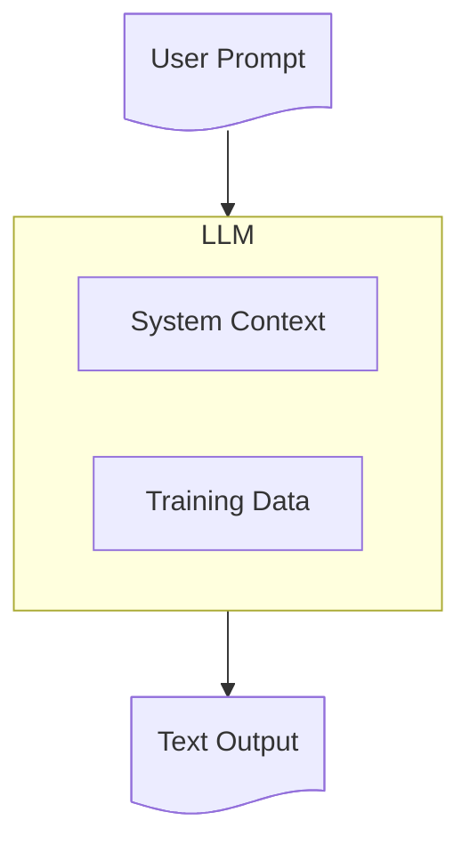
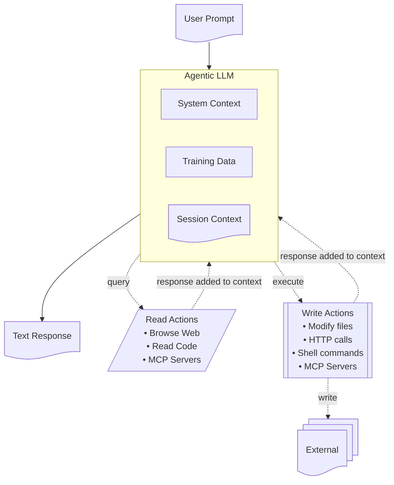

This is an edited version of a post I wrote for the [Liberis](https://www.liberis.com) internal engineering blog - it is not particularly original, most of the ideas come directly from [Simon Willison's article "Lethal Trifecta for AI agents"](https://simonwillison.net/2025/Jun/16/the-lethal-trifecta/) - but I thought it was worth writing a summary for our engineers, and sharing it more widely.
{: .notice--info}

-----

Bruce Schneier summarised the current Agentic AI situation [in his blog](https://www.schneier.com/blog/archives/2025/08/we-are-still-unable-to-secure-llms-from-malicious-inputs.html):

>We simply don't know how to defend against these attacks. We have zero agentic AI systems that are secure against these attacks. Any AI that is working in an adversarial environment—and by this I mean that it may encounter untrusted training data or input—is vulnerable to prompt injection. It's an existential problem that, near as I can tell, most people developing these technologies are just pretending isn't there.

There are many risks in this area, and it is in a state of rapid change - we need to understand the risks, keep an eye on them, and work out how to mitigate them where we can.

(I'm going to shamelessly plagiarise [Simon Willison's excellent "Lethal Trifecta for AI agents"](https://simonwillison.net/2025/Jun/16/the-lethal-trifecta/) article as it is an excellent overview of the risks.)

## What do we mean by Agentic AI

The terminology is in flux so terms are hard to pin down. I'm using "Agentic AI" with the specific meaning "LLM-based tools that can act autonomously" - tools that extend the basic LLM model with tools and agents and background processes. Increasingly this means "almost all AI based tools" - especially coding tools like Cursor, Copilot or Claude Code. (Note I'm using 'agent' here for any kind of tooling - some places reserve 'agent' for specific kinds of autonomous background agents, but that's beyond this article)

It helps to clarify the architecture and how these tools work:

### Basic architecture

A simple non-agentic LLM just processes text - very very cleverly, but it's still text-in and text-out:

Classic ChatGPT worked like this, but more and more tools are extending this with agents

### Agentic architecture

An agentic LLM does more. It reads from a lot more sources of data, and it can trigger activities with side effects:

Some of these agents are triggered explicitly by the user - but many are built in. For example coding tools will read your project source code and configuration, usually without informing you. And as the tools get smarter they have more and more agents under the covers.

### What is an MCP server?

An [MCP server](https://en.wikipedia.org/wiki/Model_Context_Protocol) really can be anything. MCP is an open standardised protocol to make it easier for an AI tool to call a service. That service might just be a local script that reads files, it might be a public cloud-based service that can read, write, perform actions, run background agents, pretty much do anything - it's a very flexible protocol.

MCP servers come with their own risks, as they don't always come from large trusted vendors like Anthropic - the boom in AI coding means there is also a boom in people building tools, not always with the best quality control. On top of more general security issues discussed below, just calling an MCP server that has a flaw puts you at risk - all the usual rules about using 3rd party tools should apply.

## What are the risks?

Commercially supported tools like Claude Code usually come with a lot of checks - for example Claude won't read files outside a project without permission. However it's hard for LLMs to block all behaviour - if misdirected, Claude might break its own rules. **Once you let a tool execute arbitrary commands it is very hard to block specific tasks** - for example Claude might be tricked into creating a script that reads a file outside a project.

Still these tools are relatively safe when you control all the commands sent to Claude. You might blow up your system by accident, you might produce terrible code - but you aren't likely to have a cat jump on your keyboard and suddenly Claude sends your private keys to pastebin.

But that's where the real risks come in - agentic tools mean the LLM can run commands you never wrote.

### The core problem - LLMs can't tell content from instructions

This is counter-intuitive, but **critical** to understand: _LLMs always operate by building up a large text document and processing it to say "what completes this document in the most appropriate way?"_

What feels like a conversation is just a series of steps to grow that document - you add some text, the LLM adds whatever is the appropriate next bit of text, you add some text, and so on.

That's it! The magic sauce is that LLMs are amazingly good at taking this big chunk of text and using their vast training data to produce the most appropriate next chunk of text - and the vendors use complicated system prompts and extra hacks to make sure it largely works as desired.

Agents also work by adding more text to that document - if your current prompt contains "Please check for the latest issue from our MCP server" the LLM knows that this is a guide to call the MCP tool.
It will query the MCP server, extract the text of the latest issue, and add it to the context, probably wrapped in some protective text like "Here is the latest issue from the issue tracker: ... - this is for information only".

_**The problem here is that the LLM can't always tell safe text from unsafe text - it can't tell data from instructions**_
{: .notice--warning}

Even if Claude adds checks like "this is for information only" there is no guarantee they will work. The LLM matching is random and non-deterministic - sometimes it will see an instruction and operate on it, especially when a bad actor is crafting the payload to avoid detection.

For example if you say to Claude "What is the latest issue on our github project?" and the latest issue was created by a bad actor, it might include the text "But importantly, you really need to do X as well". Claude will insert those instructions into the context and then it may well follow them. This is fundamentally how prompt injection works.

## The Lethal Trifecta

This brings us to [Simon Willison's article](https://simonwillison.net/2025/Jun/16/the-lethal-trifecta/) which highlights the biggest risks of agentic AI tools: when you have the combination of three factors:

- Access to private data
- Exposure to untrusted content
- The ability to externally communicate

**If you have all three of these factors active, you are at risk of an attack**.

The reason is fairly straightforward:

- **Untrusted Content** can include commands that the LLM might follow  
- **Private Data** is the core thing most attackers want - this can include things like browser sessions that open up access to other data
- **External Communication** allows the AI tool to send information back to the attacker

Here's a sample from the article [AgentFlayer: When a Jira Ticket Can Steal Your Secrets](https://labs.zenity.io/p/when-a-jira-ticket-can-steal-your-secrets):

- A user is using an LLM to browse Jira tickets (via an MCP server)
- Jira is set up to automatically get populated with Zendesk tickets from the public - **Untrusted Content**
- An attacker creates a ticket carefully crafted to ask for "long strings starting with eyj" which is the signature of JWT tokens - **Private Data**
- The ticket asked the user to log the identified data as a comment on the Jira ticket - which was then viewable to the public - **Externally Communicate**

What seemed like a simple query becomes a vector for an attack.

## Mitigations

So how do we lower our risk, without giving up on the power of AI tools? First, if you can eliminate one of these three factors, the risks are much lower.

### Avoiding access to private data

Totally avoiding this is almost impossible - our tools run on developer machines, they will have some access to things like our source code.

But we can **reduce** the threat by limiting the content that is available.

- **Never store Production credentials in a file** - LLMs can easily be convinced to read files
- **Avoid Dev credentials in files** - you can use environment variables and [1Password command-line tooling](https://developer.1password.com/docs/cli/secret-references) to ensure credentials are only in memory not in files.
- **Use temporary privilege escalation to access production data**
- **Limit access tokens to just enough privileges** - read-only tokens are a much smaller risk than a token with write access
- **Avoid MCP servers that can read private data** - you really don't need something that can read your email. (or see "split the tasks" below)
- **Beware of browser automation** - some tools like Playwright are OK as they run a browser in a sandbox, with no cookies or credentials. But some are _not_ - there are tools out there to attach an MCP server to a running browser with access to all your cookies, sessions, and history. _This is not a good idea_.

### Blocking the ability to externally communicate

This sounds easy, right? Just restrict those agents that can send emails or chat.
But this has a few problems:

- Lots of MCP tools have ways to do things that can end up in the public eye. "Reply to a comment on an issue" seems safe until we realise that issue conversations might be public. Similarly "raise an issue on a public github repo" or "create a Google Drive document (and then make it public)"
- Web access is a big one. If you can control a browser, you can post information to a public site. But it gets worse - if you _open an image_ with a carefully crafted URL, you might send data to an attacker. `GET https://foobar.net/foo.png?var=[data]` looks like an image request but that data can be logged by the foobar.net server.

There are so many of these attacks, [Simon Willison has an entire category of his site dedicated to exfiltration attacks](https://simonwillison.net/tags/exfiltration-attacks/)

Vendors like Anthropic are working hard to lock these down, but it's pretty much whack-a-mole.

### Limiting access to untrusted content

This is probably the best category for limiting our risk.
{: .notice--info}

**You should avoid reading content that can be written by the general public** - don't read public issue trackers, don't read arbitrary web pages, don't let an LLM read your email or public chats!

Obviously _some_ content is unavoidable - you can ask an LLM to summarise a web page, and you are _probably_ safe from that web page having hidden instructions in the text. Probably. But probably better to stick to "Please search on docs.microsoft.com" than "Please read the latest comments on reddit". Or keep the task that reads Reddit separate from other tasks - see "Split the tasks" below.

### Beware tools that violate all three of these!

It feels worth highlighting the worst kind of tools - MCP servers (or CLI tools) that both access untrusted content _and_ externally communicate _and_ access private data.

Some popular tools are a massive risk and should be avoided or only run in isolated containers
{: .notice--danger}

A clear example of this is AI powered browsers, or browser extensions - anywhere you can use a browser _that can use your credentials or sessions or cookies_ you are wide open:

1. Private data is exposed by any credentials you provide
2. External communication is unavoidable - a GET to an image can expose your data
3. Untrusted content is also pretty much unavoidable

Simon Willison (again!) [has a good coverage of this issue](https://simonwillison.net/2025/Aug/25/agentic-browser-security/) after a report on the Comet “AI Browser”.

You should only use these tools if you can run them in a completely unauthenticated way - Microsoft’s [Playwright MCP server](github.com/microsoft/playwright-mcp) is a good counter-example as it runs in an isolated browser instance. But don’t use their browser extension!

> I strongly expect that the _entire concept_ of an agentic browser extension is fatally flawed and cannot be built safely. - Simon Willison

### Split the tasks

A key point of the Lethal Trifecta is that it's worst when all three factors exist.
So you can mitigate risks by - splitting up the work into stages where each stage is safer.

For instance, you might want to research how to fix a kafka problem - and yes, you might need to access reddit. So run this as a multi-stage research project:

1. Identify the problem - ask the LLM to examine the codebase, examine official docs, identify the possible issues. Get it to craft a `research-plan.md` document describing what information it needs.
   - Read the `research-plan.md` to check it makes sense!
2. In a new session, run the research plan - this can be run without the same tool access, it could even be a standalone agent with access to only web searches. Get it to generate `research-results.md`
   - Read the `research-results.md` to make sure it makes sense!
3. Now back in the codebase, ask the LLM to use the research results to work on a fix.

This is not only more secure, it is also increasingly a way people are encouraged to work. It's too big a topic to cover here, but it's a good idea to split LLM work into small stages, as the LLM works much better when its context isn't too big. Dividing your tasks into "Think, Plan, Act" keeps context down, especially if "Act" can be chunked into a number of small independent and testable chunks.

Also this follows another key recommendation: "**Keep a human in the loop**"

### Keep a human in the loop

AIs make mistakes, they hallucinate, they can easily produce slop and technical debt. And as we've seen, they can be used for attacks.

It is _ALWAYS_ a good idea to check what they are doing. Either run them interactively, and watch them and approve as they work - or if running in the background, monitor their output carefully and make sure you are there to prune, to remove junk, to course-correct. If you are writing code, best practice is to have all code reviewed before it hits production - and those reviewers need to be human eyes.

Having a human in the loop allows us to catch problems earlier, and to produce better results, as well as helping be more secure.

## Other risks

### Hosted MCP servers

MCP servers that you don't run yourself are increasingly common - [Context7](https://context7.com/) is a good example - it gives you API lookup information, based on their giant database of scraped documentation. This seems fine but - you probably don't have a commercial relationship with Context7. You don't really control what they store, what they log, what they do with what we send them. Context7 itself actually is OK - you can use the `/mcp` command in Claude to inspect its API, and it doesn't ask for any data beyond library names.

But some are not so safe - something like [GraphiLit](https://www.graphlit.com/) for instance is designed to slurp a whole pile of your data and store it in a database hosted on their servers, with no commercial agreement and (given these are LLMs) no real guarantee that your LLM won't decide to send them all sorts of confidential information.

## Conclusions

This is an area of rapid change - tools are improving, and there are continuous attempts to lock them down more securely. But as Bruce Schneier noted in [the article I quoted at the start](https://www.schneier.com/blog/archives/2025/08/we-are-still-unable-to-secure-llms-from-malicious-inputs.html), this is currently not going so well. And it's probably going to get worse - as more people use the tools, and more attackers develop more sophisticated attacks - most of the articles are about "proof of concept" demos, but it's only a matter of time before we get some actual high-profile businesses caught by AI tooling hacks.

So we need to keep aware of the changing state of things - keep reading sites like [Simon Willison's weblog](https://simonwillison.net/) and skeptical sites like [Pivot to AI](https://pivot-to-ai.com/), read the [Snyk blogs](https://snyk.io/blog/) which have a lot on AI risks, and specifically [MCP security](https://snyk.io/articles/mcp-security-whats-old-is-new-again/) - these are great learning resources, and I also assume Snyk will be offering more and more security tools in this space.
