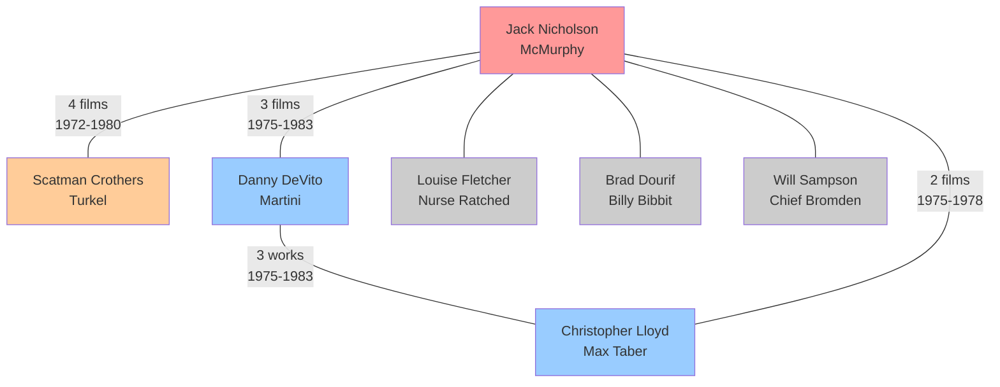
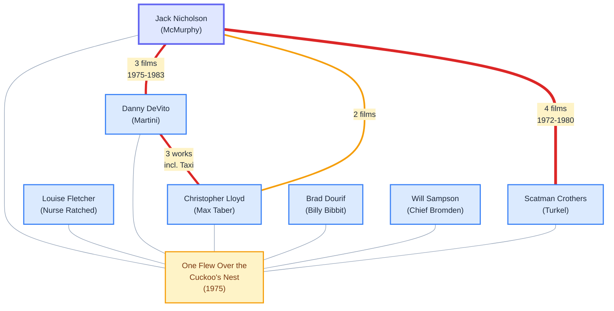
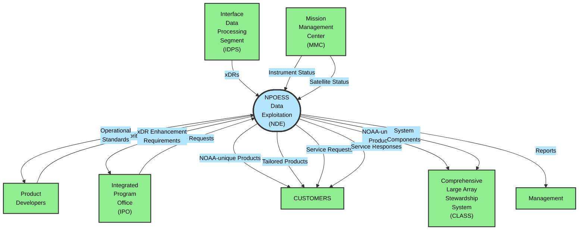
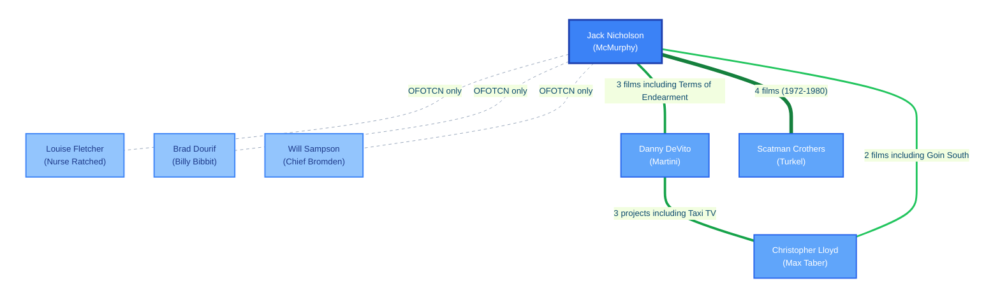
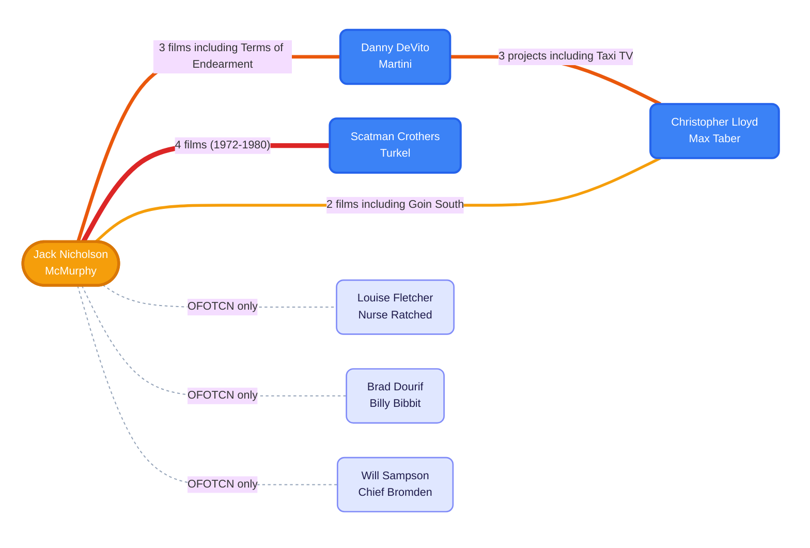

_Note_ see also my standard [AI Disclaimer](/ai-disclaimer/)

[^1]

[^1]: This secret agent mermaid was generated by Claude, inspired by Simon Willison's [pelican on a bicycle](https://simonwillison.net/2024/Oct/25/pelicans-on-a-bicycle/) LLM benchmark.

## Introduction

My last few posts have been rather theoretical, this is back to a "here is how I solved a problem" post.

A while ago I [blogged about better ways to make Mermaid diagrams](/2025/03/14/mermaid-js-revisited) but that was in the "before times" when I would do these things by hand, like a savage. OK I still edit them by hand - but LLMs like Claude Code are pretty good at drawing Mermaid - it's just text, after all.

However, out of the box, Claude is trained on sample mermaid code in the wild - so it doesn't always know the latest syntax, recent additions, or my own preferences. So this is a classic scenario where prompting can help.

## The basic prompt

My first attempt at this just embedded all my Mermaid preferences in a markdown file I could load. Note I load this _as needed_ - I don't always want to draw Mermaid diagrams, and a key thing we are all discovering about agentic LLM tools is _don't pollute the context_ - the more things you tell Claude about, the worse it performs. So for Mermaid I have a prompt command `/better-mermaid` that loads all my settings into the current session. If I start a new session, or run `/clear`, all that noise is gone.

My prompt starts:

```markdown
# Mermaid.js Guide for Claude Code

This is an advanced guide to building mermaid diagrams

## My preferences

- I like light backgrounds, so any text displayed on the background should be black or dark
- For text on shapes, you should make sure that either you use light text on a dark shape, or dark text on a light shape.

## Quick Reference

- **Hand-drawn look**: Add `config: look: handDrawn` in frontmatter
- **Invisible subgraphs**: Use `classDef invisible fill:#0000,stroke:#0000;`
- **New shape syntax**: `NodeName@{shape: diamond, label: "Decision"}`
- **Common shapes**: rect, rounded, diamond (decisions), cyl (database), doc (document), hex (process), trap-b (trapezoid), lean-r (I/O)
```

[Here is the full file](/assets/files/2025-10-10-agent-mermaid-reporting-for-duty/mermaid-basic.md).

Note this was largely generated by Claude, partly based on my previous blog post! I've tweaked it a few times but it's very hard to predict what will and won't make good diagrams; this definitely needs more tweaking over time, and to suit individual preferences.

I wanted a before-and-after comparison - so I made a [simple markdown file of all the famous actors in "One Flew Over the Cuckoo's Nest"](/assets/files/2025-10-10-agent-mermaid-reporting-for-duty/cuckoo_actors.md) - here is a diagram using Claude without any extra prompts:



and here is the same, using my basic prompt:

```txt
⏺ Now let me test the diagram to make sure it renders correctly:
  ⎿  Error: Parse error on line 20:
     ...o    nicholson ==|"2 films"| lloyd
     ----------------------^
     Expecting 'LINK', 'UNICODE_TEXT', 'EDGE_TEXT', got 'STR'
```

Oops! That was actually the first try, so I tried again:



## Better results through feedback and iteration

This is nice - but Claude didn't pick up on the error initially - we needed one key thing that helps agentic LLMs - feedback! On its own, Claude will sometimes make a mistake and not even notice. But - give it a way to get some feedback and things get much better. And it's pretty easy to get feedback on Mermaid diagrams, using the [Mermaid-cli command-line tool](https://github.com/mermaid-js/mermaid-cli) - this can syntax check mermaid diagrams, and convert them to png files using a simple command like:

```sh
npx -p @mermaid-js/mermaid-cli mmdc -s 3 -i tmp.mmd -o tmp.png
```

So I modified my prompt to gather feedback:

```markdown
You should test any mermaid diagrams you draw:
    1. extract just the mermaid diagram from the markdown file,
    2. call mermaid-cli to convert it to a png file
    3. check for any syntax errors returned
    4. read the png file to see if it looks like what was wanted
    5. delete the png file if all is OK

(followed by instructions on using mermaid-cli)
```

This means Claude can both see any syntax errors, and also _read the image that is produced_ - despite being named a "Large Language Model", Claude is actually a Multi-Modal Model and can read and interpret images. So if we tell it to, it will read the png file and "understand" it, sort-of. It's really doing something similar to what it does with language - it turns the image into some sort of tokens and then does pattern matching. The actual abilities and limitations are _very_ unclear - I encourage people to experiment. It certainly seems to be good enough for validating diagrams!

(Side note - [Anthropic have recommended maximum image sizes to use](https://docs.claude.com/en/docs/build-with-claude/vision#evaluate-image-size) - sadly `mermaid-cli` doesn't actually respect image sizes you pass to it, for really big diagrams you might need to lower the `-s 3` parameter)

[The full prompt file is here](/assets/files/2025-10-10-agent-mermaid-reporting-for-duty/mermaid-with-feedback.md)

(Another side note - I tried using SVG outputs instead, but they ended up doing much worse - the mermaid svg output files are massive and Claude didn't do well at reading them)

If you use this prompt, Claude will make a diagram, turn it into an image, and then _iterate_ - if there's an error or something that goes against your requests, it will keep trying - this is especially good for avoiding syntax errors.

## Aside - reverse engineering diagram images

Because Claude can read images, it can also _turn an image of a diagram into a mermaid diagram_. This isn't perfect - a lot of diagrams can't be turned exactly into Mermaid - but it works pretty well. Just yesterday a colleague sent me a screenshot of a mermaid diagram they'd drawn, and I just pasted it into Claude Code (you can paste images directly into Claude Code!) and said "please generate a mermaid diagram from this image".

For another example - if I grab the diagram from [this wikipedia page](https://en.wikipedia.org/wiki/System_context_diagram):


And ask Claude to turn it into a mermaid diagram, I get:



It looks quite different - Mermaid doesn't really let you tweak layout much - but the content is correct (I haven't checked closely!) and now I have an easily modified diagram.

## A further refinement - using a subagent

The only downside of all of this mermaid processing is - it consumes context.  A key thing I've learned in the last few months is that _LLMs have limited context storage, and the more context you give them, the worse they work_. Basically, too much information confuses them - they start ignoring things, they start getting tangled up. This is especially true if you change the subject a lot - ask an LLM about "One Flew Over the Cuckoo's Nest" and then about "subgraphs in mermaid" and you run the risk of getting poorer results. Especially if you run out of context - Claude has an auto-packing mechanism that compresses context for you, but it isn't perfect - and generally you are far better using `/clear` and starting from scratch as often as you can.

So if I want to draw one diagram, the basic feedback-driven prompt is fine - but if I want to draw a lot, I use a sub-agent. In Claude Code, a sub-agent is simply a markdown file in a special location - `~/.claude/agents/` for global agents ([read the docs](https://docs.claude.com/en/docs/claude-code/sub-agents) for more details) which Claude can run _as a child process_. The main Claude context is inherited by the child, but it has its own context, and when it finishes, all of its temporary workings are thrown away.

This is great for keeping things clean - I have an agent that knows about `mermaid-cli` and does all the image parsing and syntax checking for me, but my main context doesn't care.

My agent is pretty simple:

```markdown
---
name: mermaid-diagram-validator
description: Use this agent to validate Mermaid.js diagram syntax and visual quality from a file. Provide a file path to either a .mmd file (pure Mermaid) or .md file (markdown with embedded Mermaid diagrams). 
tools: Bash, Read
model: sonnet
---

You are an expert Mermaid.js diagram validator with deep knowledge of diagram rendering, visual accessibility, and the Mermaid CLI toolchain. Your primary responsibility is to validate Mermaid diagram code by generating actual PNG outputs and analysing them for both technical correctness and visual quality.

**IMPORTANT**: Before starting validation, read `/Users/korny/ai/prompts/mermaid.md` to understand the user's Mermaid preferences, styling guidelines, and best practices. Use this information when providing feedback and suggestions.
...
```

(Note the YAML description is actually a fair bit longer - see [the full mermaid-diagram-validator.md](/assets/files/2025-10-10-agent-mermaid-reporting-for-duty/mermaid-diagram-validator.md) for the full text)

Then my main [mermaid-agentic.md](/assets/files/2025-10-10-agent-mermaid-reporting-for-duty/mermaid-agentic.md) just says "use the agent" :

```markdown
# Mermaid.js Guide for Claude Code

This is an advanced guide to building mermaid diagrams

## Testing with the mermaid-diagram-validator subagent

**ALWAYS** test any mermaid diagrams you draw using the mermaid-diagram-validator subagent before you consider them done. **NEVER** trust your judgement - the agent will do a better job.
```

The output is basically the same as the non-agent version; though LLMs being non-deterministic, every time you get a different diagram:



I didn't like this so I asked:

> the diagram is still a bit ugly - can you clear it up and make it look nicer?

and got:



For a real problem I tend to iterate a lot - "Can you group these things together?" or "Can you change the colour of X to something more blue-green?" - but it's quite straightforward.

Note, by the way, that this is a fun example of using agents but not a _huge_ improvement. I find myself going back to the non-agentic version for tweaking - it uses more context, but it also knows a lot more about the image produced - the agentic version has to turn the image to a text description, which means it loses a bit of information along the way. But for generating a lot of diagrams quickly, it's great - especially when I'm documenting a whole project, I just want diagrams that work and want them quickly.

There is one slight hassle - permissions. Claude will prompt you over and over again "Do you want to run `npx -p @mermaid-js/mermaid-cli mmdc -s 3 -i ...`?" - in theory [you can set Bash permissions with wildcards](https://docs.claude.com/en/docs/claude-code/iam#tool-specific-permission-rules) but in my experience it just doesn't work, except for very simple exact matches. Even giving it permissions `Bash(rm /tmp/mermaid:*)` doesn't work - I get asked for every single file removal. I don't mind Claude being cautious here - but it is very tedious that it asks ever single time.

So I built a workaround - using their suggestion [Additional permission control with hooks](https://docs.claude.com/en/docs/claude-code/iam#additional-permission-control-with-hooks) - which I'll document in the next post!
