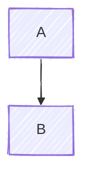

# Mermaid.js Guide for Claude Code

This is an advanced guide to building mermaid diagrams

## Testing with the mermaid-diagram-validator subagent

**ALWAYS** test any mermaid diagrams you draw using the mermaid-diagram-validator subagent before you consider them done. **NEVER** trust your judgement - the agent will do a better job.

## My prefrences

- I like light backgrounds, so any text displayed on the background should be black or dark
- For text on shapes, you should make sure that either you use light text on a dark shape, or dark text on a light shape.
- I sometimes like the hand-drawn look but rarely - only apply hand-drawn if I request it.

## Quick Reference

- **Invisible subgraphs**: Use `classDef invisible fill:#0000,stroke:#0000;`
- **New shape syntax**: `NodeName@{shape: diamond, label: "Decision"}`
- **Common shapes**: rect, rounded, diamond (decisions), cyl (database), doc (document), hex (process), trap-b (trapezoid), lean-r (I/O)

## Frontmatter configuration

If you need to configure a mermaid diagram - standalone or embedded in a markdown file - you can do it with YAML frontmatter:

## Customizing using themes

You can set a theme in the frontmatter as above - unless instructed otherwise you should probably leave this as the default, or use `base` which then allows you to customize things like the main colour scheme:

Theme variables if you need them are at <https://mermaid.js.org/config/theming.html#theme-variables>

## Hand-drawn style

On occasion the user may want a hand-drawn style - this is again set in front matter:

## Flowchart Features

### Shape Syntax

Use `NodeName@{shape: shapeName, label: "Label"}` for custom shapes:

### Invisible Subgraphs for Layout Control

A powerful technique for grouping related nodes without visual borders:

This technique:

- Groups nodes logically for better layout
- Maintains visual separation
- Helps Mermaid's layout engine position related items together
- Uses empty label `[" "]` to hide subgraph titles

### Using classDef

Define reusable styles:

## Sequence Diagrams

## Advanced Techniques

### Styling Edges

Use linkStyle to style specific edges (numbered in order of definition):

### General Tips

- **Group related nodes** - Use subgraphs (visible or invisible) to help the layout engine
- **Define styles once** - Use `classDef` at the top rather than inline styles
- **Limit diagram complexity** - Break large diagrams into multiple smaller ones
- **Use appropriate diagram types** - Don't force complex relationships into flowcharts when other diagrams would be clearer

## Best Practices

1. **Diagram selection**: Flowchart for processes, Sequence for interactions, ER for databases
2. **Style consistently**: Use `classDef` with semantic names (primary, error)
3. **Layout control**: Use invisible subgraphs, test orientations (TB, LR, RL, BT)
4. **Keep it simple**: Break complex diagrams into smaller ones
