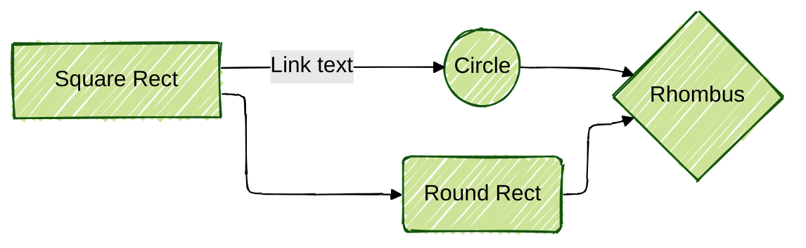

# Mermaid testing

This is just to check what Mermaid version github uses.

In a `mermaid` block including this shows the version

```text
info
```

Current version:

```mermaid
info
```

Elk test:



